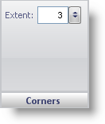

////

|metadata|
{
    "name": "wingauge-annotations-corners-pane",
    "controlName": ["WinGauge"],
    "tags": ["Charting"],
    "guid": "{94DD81C6-ECA2-4053-B060-685C8271A778}",  
    "buildFlags": [],
    "createdOn": "0001-01-01T00:00:00Z"
}
|metadata|
////

= Corners Pane

The Corners pane is used to determine the shape of the corners on your annotation.

pick:[win-forms="link:{ApiPlatform}win.ultrawingauge{ApiVersion}~infragistics.ultragauge.resources.boxannotation~cornerextent.html[Extent]"]  -- Set this value to an integer from 0 to 100. The extent value determines the roundness of the corners on your annotation.

== Related Topic

link:wingauge-annotations-tab.html[Annotations Tab]