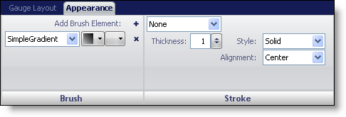
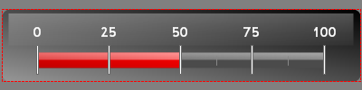

////

|metadata|
{
    "name": "wingauge-appearance-tab",
    "controlName": ["WinGauge"],
    "tags": [],
    "guid": "{B02422EF-BD19-425D-BC35-1AE72B92183A}",  
    "buildFlags": [],
    "createdOn": "0001-01-01T00:00:00Z"
}
|metadata|
////

= Appearance Tab

The Appearance tab allows you to customize the appearance of each property. You can access this tab by either clicking on any item in the Gauge Explorer or clicking any item on your gauge in the interactive preview area.

The tab is divided into two panes:

* link:wingauge-brush-pane.html[Brush]
* link:wingauge-stroke-pane.html[Stroke]

The following screen shot shows a Linear gauge that was created according to the appearance settings specified in the above screen shot.

