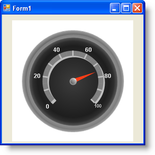

////

|metadata|
{
    "name": "wingauge-apply-shadow-effects",
    "controlName": ["WinGauge"],
    "tags": ["Charting"],
    "guid": "{38EB72D4-C607-4D0D-9967-F394BE4F7601}",  
    "buildFlags": [],
    "createdOn": "0001-01-01T00:00:00Z"
}
|metadata|
////

= Apply Shadow Effects

Shadow effects visually enhance and add depth to a property on your gauge, giving the property a 3D appearance.

This topic assumes that you already created a Radial gauge. For information on how to create a Radial gauge, see link:wingauge-getting-started-with-wingauge.html[Getting Started with WinGauge].

You can apply a shadow effect to a property on your gauge:

* <<gaugeDesigner,using the Gauge Designer>>
* <<designTime,at design time>>
* <<runTime,at run time>>

When you save and run your application after completing the following steps, your gauge should look similar to the gauge below.

[[gaugeDesigner]]
*To apply a shadow effect to the Range property of your Radial gauge using the Gauge Designer:*

[start=1]
. In the Gauge Explorer or the interactive preview area, select the property to which you want to apply the shadow effect.
[start=2]
. In the link:wingauge-effects-tab.html[Effects tab] of the Properties panel, select link:wingauge-solid-brush-element.html[Solid] from the Type drop-down list of the link:wingauge-shadow-brush-pane.html[Shadow Brush pane].
[start=3]
. Click the Details the drop-down arrow.
[start=4]
. The color picker appears. On the left-hand side, click Web, then select the Silver color.
[start=5]
. When you are finished specifying the color, click anywhere in the Shadow Brush pane.
[start=6]
. You can see the shadow effect applied to the Range property of your gauge in the interactive preview area.

[[designTime]]
*To apply a shadow effect to the Range property of your Radial gauge in at design time:*

[start=1]
. In the left-hand pane of the Gauges collection editor, click Radial Gauge.
[start=2]
. Locate the  pick:[win-forms="link:{ApiPlatform}win.ultrawingauge{ApiVersion}~infragistics.ultragauge.resources.radialgauge~scales.html[Scales]"]  property and click the ellipsis button (…) to launch the Scales collection editor.
[start=3]
. Locate the  pick:[win-forms="link:{ApiPlatform}win.ultrawingauge{ApiVersion}~infragistics.ultragauge.resources.radialgaugescale~ranges.html[Ranges]"]  property and click the ellipsis button (...) to launch the Ranges collection editor.
[start=4]
. Locate and expand the  pick:[win-forms="link:{ApiPlatform}win.ultrawingauge{ApiVersion}~infragistics.ultragauge.resources.radialgaugerange~shadow.html[Shadow]"]  property.
[start=5]
. Locate the  pick:[win-forms="link:{ApiPlatform}win.ultrawingauge{ApiVersion}~infragistics.ultragauge.resources.gauge~brushelement.html[BrushElement]"]  property.
[start=6]
. From the BrushElement drop-down list, select Solid Fill. This will create a new Solid Fill BrushElement.
[start=7]
. Expand the newly created BrushElement property, and locate the  pick:[win-forms="link:{ApiPlatform}win.ultrawingauge{ApiVersion}~infragistics.ultragauge.resources.solidfillbrushelement~color.html[Color]"]  property.
[start=8]
. Set the Color property to Silver.
[start=9]
. Set the  pick:[win-forms="link:{ApiPlatform}win.ultrawingauge{ApiVersion}~infragistics.ultragauge.resources.shadow~angle.html[Angle]"]  property to 45 and the  pick:[win-forms="link:{ApiPlatform}win.ultrawingauge{ApiVersion}~infragistics.ultragauge.resources.shadow~depth.html[Depth]"]  property to 5.

[[runTime]]
*To apply a shadow effect to the Range property of your Radial gauge using code:*

[start=1]
. Instantiate the following classes.

*In Visual Basic:*

----
Dim mySolidFillBrushElement As New SolidFillBrushElement()
Dim myRadialGauge As RadialGauge = Me.UltraGauge1.Gauges(0)
Dim myRange As RadialGaugeRange = myRadialGauge.Scales(0).Ranges(0)
----

*In C#:*

----
SolidFillBrushElement mySolidFillBrushElement = new SolidFillBrushElement();
RadialGauge myRadialGauge = this.ultraGauge1.Gauges[0] as RadialGauge;
RadialGaugeRange myRange = myRadialGauge.Scales[0].Ranges[0];
----

[start=2]
. Set the Color property to Silver.

*In Visual Basic:*

----
mySolidFillBrushElement.Color = System.Drawing.Color.Silver
myRange.Shadow.BrushElement = mySolidFillBrushElement
----

*In C#:*

----
mySolidFillBrushElement.Color = System.Drawing.Color.Silver;
myRange.Shadow.BrushElement = mySolidFillBrushElement;
----