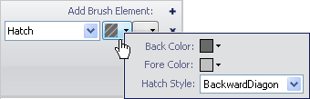
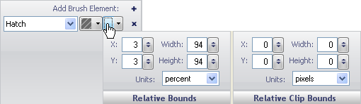

////

|metadata|
{
    "name": "wingauge-apply-the-hatch-brush-element-using-the-gauge-designer",
    "controlName": ["WinGauge"],
    "tags": ["Charting","Design Environment"],
    "guid": "{32519197-48DB-4E43-90F5-9B4CFF6C5FD8}",  
    "buildFlags": [],
    "createdOn": "0001-01-01T00:00:00Z"
}
|metadata|
////

= Apply the Hatch Brush Element Using the Gauge Designer

Applying the Hatch brush element to a visual in your gauge gives that element a two-color patterned appearance.

*To apply the Hatch element to a property of your gauge using the Gauge Designer:*

[start=1]
. In the Gauge Explorer or the interactive preview area, select the property to which you want to apply the Hatch brush element.
[start=2]
. In the Appearance tab of the Properties panel, select Hatch from the Type drop-down list.
[start=3]
. Click the Details drop-down arrow.
[start=4]
. In the small window that appears, set the following properties:

** Back Color - Click the drop-down arrow. The color picker appears. On the left-hand side, click Web, then select the DimGray color.
** Fore Color - Click the drop-down arrow. The color picker appears. On the left-hand side, click Web, then select the Silver color.
** Hatch Style - From the drop-down list, select BackwardDiagonal

[start=5]
. When you are finished specifying the properties, click anywhere in the Brush pane.
[start=6]
. Click the Relative Bounds editor drop-down arrow.
[start=7]
. In the Relative Bounds pane that appears, set the following properties:

** X - 3
** Y - 3
** Width - 94
** Height - 94

[start=8]
. In the Relative Clip Bounds pane that appears, set the following properties:

** X - 0
** Y - 0
** Width - 0
** Height - 0

[start=9]
. You can see the Hatch brush element applied to the selected property in the interactive preview area.

== Related Topics

link:wingauge-hatch-brush-element.html[Hatch Brush Element]

link:wingauge-apply-the-hatch-brush-element-at-design-time.html[Apply the Hatch Brush Element at Design Time]

link:wingauge-apply-the-hatch-brush-element-at-run-time.html[Apply the Hatch Brush Element at Run Time]