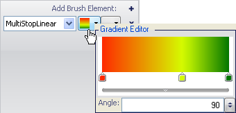
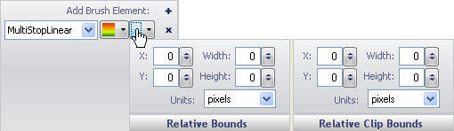

////

|metadata|
{
    "name": "wingauge-apply-the-multi-stop-linear-gradient-brush-element-using-the-gauge-designer",
    "controlName": ["WinGauge"],
    "tags": ["Charting","Design Environment"],
    "guid": "{D5A8AAB8-6F35-41D7-B402-3463D3C9BD86}",  
    "buildFlags": [],
    "createdOn": "0001-01-01T00:00:00Z"
}
|metadata|
////

= Apply the Multi Stop Linear Gradient Brush Element Using the Gauge Designer

If you want more than two colors of a property of your gauge to blend into each other in a linear fashion, apply the Multi-Stop Linear Gradient brush element to the property.

*To apply a Multi-Stop Linear Gradient brush element to your property using the Gauge Designer:*

[start=1]
. In the Gauge Explorer or the interactive preview area, select the property to which you want to apply the Multi-Stop Linear Gradient brush element.
[start=2]
. In the Appearance tab of the Properties panel, select MultiStopLinearGradient from the Type drop-down list.
[start=3]
. Click the Details drop-down arrow.
[start=4]
. In the Gradient Editor, click under the color scales to add a new color stop.
[start=5]
. Right click on the color stop to change the color.
[start=6]
. Drag the color stop to change the offset.
[start=7]
. The following step allows you to edit the values with more precision.
[start=8]
. Click the small arrow on the horizontal bar then set the following properties:

** Start color - Click the first cell in the first row. Enter the value 254, 42, 0 in the text box.
** Start color offset - Click the second cell in the first row. Enter the value 0 in the text box.
** Color stop - Click the first cell in the second row. Enter the value 212, 254, 0 in the text box.
** Color stop offset - Click the second cell in the second row. Enter the value 0.637 in the text box.
** End color - Click the first cell in the third row. Enter the value 0, 118, 0 in the text box.
** End color offset - Click the second cell in the third row. Enter the value 1 in the text box.
** Angle - Enter the value 90 in the text box.

[start=9]
. When you are finished specifying the properties, click anywhere in the Brush pane.
[start=10]
. Click the Relative Bounds editor drop-down arrow.
[start=11]
. In the Relative Bounds pane that appears, set the following properties:

** X - 0
** Y - 0
** Width - 0
** Height - 0

[start=12]
. In the Relative Clip Bounds pane that appears, set the following properties:

** X - 0
** Y - 0
** Width - 0
** Height - 0

[start=13]
. You can see the Multi-Stop Linear Gradient brush element applied to the selected property of your gauge in the interactive preview area.

== Related Topics

link:wingauge-multi-stop-linear-gradient-brush-element.html[Multi-Stop Linear Gradient Brush Element]

link:wingauge-apply-the-multi-stop-linear-gradient-brush-element-at-design-time.html[Apply the Multi-Stop Linear Gradient Brush Element at Design Time]

link:wingauge-apply-the-multi-stop-linear-gradient-brush-element-at-run-time.html[Apply the Multi-Stop Linear Gradient Brush Element at Run Time]