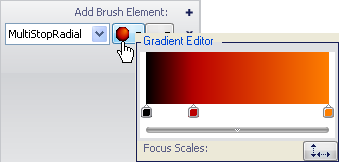
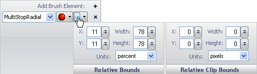

////

|metadata|
{
    "name": "wingauge-apply-the-multi-stop-radial-gradient-brush-element-using-the-gauge-designer",
    "controlName": ["WinGauge"],
    "tags": ["Charting","Design Environment"],
    "guid": "{F1B1CBEA-B35B-4E21-97C2-55E74F637AA0}",  
    "buildFlags": [],
    "createdOn": "0001-01-01T00:00:00Z"
}
|metadata|
////

= Apply the Multi Stop Radial Gradient Brush Element Using the Gauge Designer

If you want more than two colors of a property of your gauge to blend into each other in a circular fashion, apply the Multi-Stop Radial Gradient brush element to the property.

*To apply a Multi-Stop Radial Gradient brush element to your property using the Gauge Designer:*

[start=1]
. In the Gauge Explorer or the interactive preview area, select the property to which you want to apply the Multi-Stop Radial Gradient brush element.
[start=2]
. In the Appearance tab of the Properties panel, select MultiStopRadialGradient from the Type drop-down list.
[start=3]
. Click the Details drop-down arrow.
[start=4]
. In the Gradient editor, click under the color scales to add a new color stop.
[start=5]
. Right click on the color stop to change the color.
[start=6]
. Drag the color stop to change the offset.
[start=7]
. The following step allows you to edit the values with more precision.
[start=8]
. Click the small arrow on the horizontal bar. Then set the following properties:

** Start color - Click the first cell in the first row. Click the drop-down arrow. The color picker appears. On the left-hand side, click Web, then select the Black color.
** Start color offset - Click the second cell in the first row. Enter the value 0 in the text box.
** Color stop - Click the first cell in the second row. Enter the value 186, 0 ,0 in the text box.
** Color stop offset - Click the second cell in the second row. Enter the value 0.264 in the text box.
** End color - Click the first cell in the third row. Enter the value 254, 127, 0 in the text box.
** End color offset - Click the second cell in the third row. Enter the value 1 in the text box.

[start=9]
. In the Gradient Editor, click the Focus Scales button. The Focus Scales Editor appears. Using the horizontal and vertical slider bars select the surround point. In the circle, drag the smaller circle to set the center point.
[start=10]
. When you are finished specifying the properties, click anywhere in the Brush pane.
[start=11]
. Click the Relative Bounds editor drop-down arrow.
[start=12]
. In the Relative Bounds pane that appears, set the following properties:

** X - 11
** Y - 11
** Width - 78
** Height - 78

[start=13]
. In the Relative Clip Bounds pane that appears, set the following properties:

** X - 0
** Y - 0
** Width - 0
** Height - 0

[start=14]
. You can see the Multi-Stop Radial Gradient brush element applied to the selected property of your gauge in the interactive preview area.

== Related Topics

link:wingauge-multi-stop-radial-gradient-brush-element.html[Multi Stop Radial Gradient Brush Element]

link:wingauge-apply-the-multi-stop-radial-gradient-brush-element-at-design-time.html[Apply the Multi Stop Radial Gradient Brush Element at Design Time]

link:wingauge-apply-the-multi-stop-radial-gradient-brush-element-at-run-time.html[Apply the Multi Stop Radial Gradient Brush Element at Run Time]