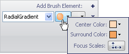
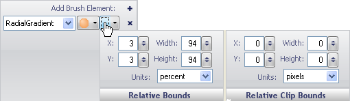

////

|metadata|
{
    "name": "wingauge-apply-the-radial-gradient-brush-element-using-the-gauge-designer",
    "controlName": ["WinGauge"],
    "tags": ["Charting","Design Environment"],
    "guid": "{2C97AB45-7717-403D-9F3E-9EB1FDCF9F81}",  
    "buildFlags": [],
    "createdOn": "0001-01-01T00:00:00Z"
}
|metadata|
////

= Apply the Radial Gradient Brush Element Using the Gauge Designer

If you want two colors of a property of your gauge to blend into each other in a circular way, apply the Radial Gradient brush element to the property.

*To apply the Radial Gradient brush element to a property of your gauge using the Gauge Designer:*

[start=1]
. In the Gauge Explorer or the interactive preview area, select the property to which you want to apply the Radial Gradient brush element.
[start=2]
. In the Appearance tab of the Properties panel, select RadialGradient from the Type drop-down list.
[start=3]
. Click the Details drop-down arrow.
[start=4]
. In the Gradient Editor, set the following properties:

** Center color - Click the drop-down arrow. The color picker appears. On the left-hand side, click Web, then select the Peach Puff color.
** Surround color - Click the drop-down arrow. The color picker appears. On the left-hand side, click Web, then select the Sandy Brown color.

[start=5]
. In the Gradient Editor, click the Focus Scale button. The Focus Scale Editor appears. Using the horizontal and vertical slider bars select the surround point. In the circle, drag the smaller circle to set the center point.
[start=6]
. When you are finished specifying the properties, click anywhere in the Brush pane.
[start=7]
. Click the Relative Bounds editor drop-down arrow.
[start=8]
. In the Relative Bounds pane that appears, set the following properties:

** X - 3
** Y - 3
** Width - 94
** Height - 94

[start=9]
. In the Relative Clip Bounds pane that appears, set the following properties:

** X - 0
** Y - 0
** Width - 0
** Height - 0

[start=10]
. You can see the Radial Gradient brush element applied to the selected property of your gauge in the interactive preview area.

== Related Topics

link:wingauge-radial-gradient-brush-element.html[Radial Gradient Brush Element]

link:wingauge-apply-the-radial-gradient-brush-element-at-design-time.html[Apply the Radial Gradient Brush Element at Design Time]

link:wingauge-apply-the-radial-gradient-brush-element-at-run-time.html[Apply the Radial Gradient Brush Element at Run Time]