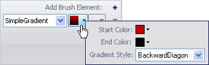
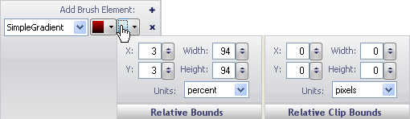

////

|metadata|
{
    "name": "wingauge-apply-the-simple-gradient-brush-element-using-the-gauge-designer",
    "controlName": ["WinGauge"],
    "tags": ["Charting","Design Environment"],
    "guid": "{768CD994-6224-4462-B12E-32B4306255EF}",  
    "buildFlags": [],
    "createdOn": "0001-01-01T00:00:00Z"
}
|metadata|
////

= Apply the Simple Gradient Brush Element Using the Gauge Designer

If you want a property of your gauge to start with one color and fade into another color in a specific way, apply the Simple Gradient brush element to the property.

*To apply the Simple Gradient brush element to a property of your gauge using the Gauge Designer:*

[start=1]
. In the Gauge Explorer or the interactive preview area, select the property to which you want to apply the Simple Gradient brush element.
[start=2]
. In the Appearance tab of the Properties panel, select SimpleGradient from the Type drop-down list.
[start=3]
. Click the Details drop-down arrow.
[start=4]
. In the Gradient Editor, set the following properties:

** Start Color - Click the drop-down arrow. The color picker appears. On the left-hand side, click Web, then select the Firebrick color.
** End Color - Click the drop-down arrow. The color picker appears. On the left-hand side, click Web, then select the Black color.
** Gradient Style - From the drop-down list, select Backward Diagonal.

[start=5]
. When you are finished specifying the properties, click anywhere in the Brush pane.
[start=6]
. Click the Relative Bounds editor drop-down arrow.
[start=7]
. In the Relative Bounds pane that appears, set the following properties:

** X - 3
** Y - 3
** Width - 94
** Height - 94

[start=8]
. In the Relative Clip Bounds pane that appears, set the following properties:

** X - 0
** Y - 0
** Width - 0
** Height - 0

[start=9]
. You can see the Simple Gradient brush element applied to the selected property of your gauge in the interactive preview area.

== Related Topics

link:wingauge-simple-gradient-brush-element.html[Simple Gradient Brush Element]

link:wingauge-apply-the-simple-gradient-brush-element-at-design-time.html[Apply the Simple Gradient Brush Element at Design Time]

link:wingauge-apply-the-simple-gradient-brush-element-at-run-time.html[Apply the Simple Gradient Brush Element at Run Time]