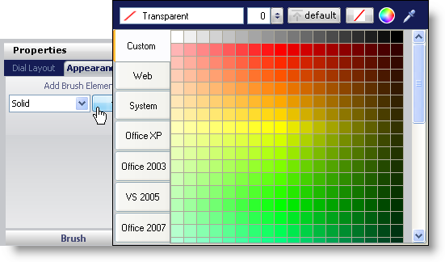
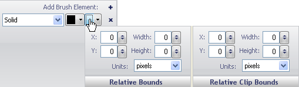

////
|metadata|
{
    "name": "wingauge-apply-the-solid-brush-element-using-the-gauge-designer",
    "controlName": ["WinGauge"],
    "tags": ["Charting","Design Environment"],
    "guid": "{1D1832C9-C1DE-4AFF-95A2-C15B207A2EE5}",
    "buildFlags": [],
    "createdOn": "0001-01-01T00:00:00Z"
}
|metadata|
////

= Apply the Solid Brush Element Using the Gauge Designer

If you wanted a property of your gauge to be one solid color, apply the Solid brush element to the property.

*To apply the Solid brush element to a property of your gauge using the Gauge Designer:*

. In the Gauge Explorer or the interactive preview area, select the property to which you want to apply the Solid brush element.
. In the Appearance tab of the Properties panel, select Solid from the Type drop-down list.
. Click the Details drop-down arrow.
. The color picker appears. On the left-hand side, click Web, then select the Black color.
+

. When you are finished specifying the color, click anywhere in the Brush pane.
. Click the Relative Bounds editor drop-down arrow.
. In the Relative Bounds pane that appears, set the following properties:

** X - 0
** Y - 0
** Width - 0
** Height - 0

. In the Relative Clip Bounds pane that appears, set the following properties:

** X - 0
** Y - 0
** Width - 0
** Height - 0

+

. You can see the Solid brush element applied to the property of your gauge in the interactive preview area.

//*!!Screen shot of property in interactive area!!!*

== Related Topics

link:wingauge-solid-brush-element.html[Solid Brush Element]

link:wingauge-apply-the-solid-fill-brush-element-at-design-time.html[Apply the Solid Brush Element at Design Time]

link:wingauge-apply-the-solid-brush-element-at-run-time.html[Apply the Solid Brush Element at Run Time]