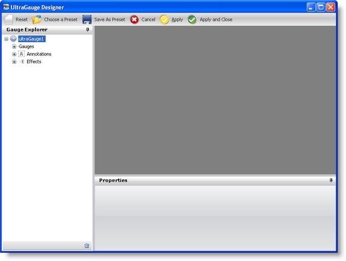
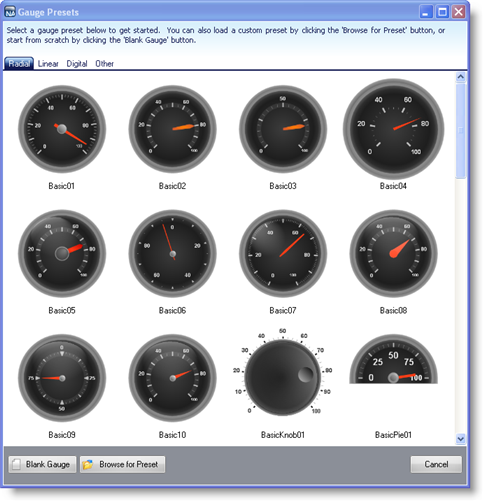
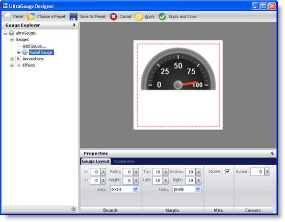

////

|metadata|
{
    "name": "wingauge-applying-a-preset",
    "controlName": ["WinGauge"],
    "tags": ["Charting"],
    "guid": "{22A6BD0D-77DD-42DE-84FC-AC4ED5BCF912}",  
    "buildFlags": [],
    "createdOn": "0001-01-01T00:00:00Z"
}
|metadata|
////

= Applying a Preset

When you apply a preset from the Gauge Designer, it is added to your form. You can then create visually impressive applications that use gauges.

*To apply a preset to the WinGauge control:*

[start=1]
. From the toolbox, drag the UltraGauge control to your form. The Gauge Designer opens.

[start=2]
. On the toolbar, click Open Presets. The Gauge Presets dialog box opens with the Radial tab selected by default.

[start=3]
. Select a predefined Radial gauge. When you select a gauge it appears in the interactive preview area.

[start=4]
. To create a Radial gauge using the selected preset without closing the Gauge Designer, click Apply. To create a Radial gauge using the selected preset and automatically close the designer, click Apply and Close.