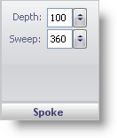
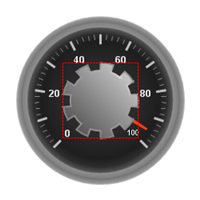

////

|metadata|
{
    "name": "wingauge-back-anchor-spoke-pane",
    "controlName": ["WinGauge"],
    "tags": ["Charting"],
    "guid": "{9D088B27-1FDB-49DB-A521-736BCCB954E2}",  
    "buildFlags": [],
    "createdOn": "0001-01-01T00:00:00Z"
}
|metadata|
////

= Spoke Pane

The Spoke pane is used to edit the shape of the back anchor. A depth value of 100 and a sweep value of 360 is circle. As the values decrease, the spokes become more visible.

pick:[win-forms="link:{ApiPlatform}win.ultrawingauge{ApiVersion}~infragistics.ultragauge.resources.radialgaugeneedleanchor~spokedepth.html[Depth]"]  -- Set this value to an integer from 0 to 100. This value is the distance between each spoke and the center of your Radial gauge.

pick:[win-forms="link:{ApiPlatform}win.ultrawingauge{ApiVersion}~infragistics.ultragauge.resources.radialgaugeneedleanchor~spokesweep.html[Sweep]"]  -- Set this value to an integer from 0 to 360. This value is the angular measurement of each spoke. The "spoke" appearance of the back anchor is visible only when the sweep value is less than 100.

The following screen shot shows a back anchor and an anchor with the radius value set to 45, the depth value set to 80 and the sweep value set to 20.

== Related Topic

link:wingauge-back-anchor-layout-tab.html[Back Anchor Layout Tab]