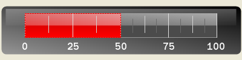
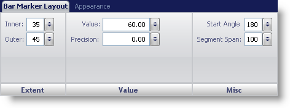
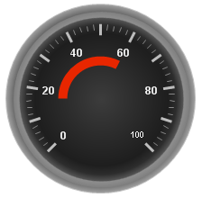

////

|metadata|
{
    "name": "wingauge-bar-marker-layout-tab",
    "controlName": ["WinGauge"],
    "tags": ["Charting"],
    "guid": "{9D5E4FE5-803A-4D00-84AA-C9502E2CCACF}",  
    "buildFlags": [],
    "createdOn": "0001-01-01T00:00:00Z"
}
|metadata|
////

= Bar Marker Layout Tab

The  pick:[win-forms="link:{ApiPlatform}win.ultrawingauge{ApiVersion}~infragistics.ultragauge.resources.radialgaugebarmarker.html[Bar Marker]"]  property of the WinGauge control is used to point out values on a scale of your Linear or Radial gauge. A Bar Marker is displayed as bars that have a start and end point on the scale. For example, if you were creating a Linear gauge to represent a thermometer you would use a bar marker to display the mercury level.

You can customize the bar marker on your gauge using the Bar Marker Layout tab of the Properties panel. You can access this tab by either clicking Bar Marker in the Gauge Explorer (Gauge > Scales > Markers > Bar Marker) or clicking a bar marker on your gauge in the interactive preview area.

The tab is divided into three panes:

* link:wingauge-extent-pane.html[Extent]
* link:wingauge-value-pane.html[Value]
* link:wingauge-misc-pane.html[Misc]

The following screen shot shows the Bar Marker Layout tab for a Linear gauge.

The following screen shot shows a bar marker that was created according to settings specified in the above screen shot.

The Bar Marker properties for a Radial gauge are slightly different. It does not have a Blub Span property, instead it has a Start Angle property. The following screen shot shows the Bar Marker Layout tab for a Radial gauge.

The following screen shot shows a bar marker that was created according to settings specified in the above screen shot.

