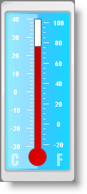

////

|metadata|
{
    "name": "wingauge-bar-marker",
    "controlName": ["WinGauge"],
    "tags": ["Charting"],
    "guid": "{DA518F0E-23F5-441D-9D9F-A810609FBE59}",  
    "buildFlags": [],
    "createdOn": "0001-01-01T00:00:00Z"
}
|metadata|
////

= Bar Marker

Bar markers are displayed as bars that have a start and end point on the scale of your Radial or Linear gauge.

For example, if you were creating a Linear gauge to represent a thermometer you would use a bar marker to display the mercury level.

== Related Topic

link:wingauge-add-a-bar-marker-to-a-gauge.html[Add a Bar Marker to a Gauge]