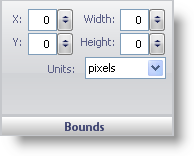

////

|metadata|
{
    "name": "wingauge-bounds-pane3",
    "controlName": ["WinGauge"],
    "tags": ["Charting"],
    "guid": "{5E3B6219-3F90-43F5-9259-032776559515}",  
    "buildFlags": [],
    "createdOn": "0001-01-01T00:00:00Z"
}
|metadata|
////

= Bounds Pane

The Bounds pane determines the size and the location of your gauge on the WinGauge control.

pick:[win-forms="link:{ApiPlatform}win.ultrawingauge{ApiVersion}~infragistics.ultragauge.resources.gauge~bounds.html[X]"]  -- This value determines the distance of your gauge from the left of the Gauge control. If you set the x value to exceed the width of the Gauge control or to be less than 0, your gauge may not appear on the Gauge control.

pick:[win-forms="link:{ApiPlatform}win.ultrawingauge{ApiVersion}~infragistics.ultragauge.resources.gauge~bounds.html[Y]"]  -- The value determines the distance of the your gauge from the top of the Gauge control. If you set the y value to exceed the height of the Gauge control or to be less than 0, your gauge may not appear on the Gauge control.

pick:[win-forms="link:{ApiPlatform}win.ultrawingauge{ApiVersion}~infragistics.ultragauge.resources.gauge~bounds.html[Width]"]  -- The width value can be set from 0 to 100. This value determines the width of your gauge.

pick:[win-forms="link:{ApiPlatform}win.ultrawingauge{ApiVersion}~infragistics.ultragauge.resources.gauge~bounds.html[Height]"]  -- The height value can be set from 0 to 100. This value determines the height of your gauge.

pick:[win-forms="link:{ApiPlatform}win.ultrawingauge{ApiVersion}~infragistics.ultragauge.resources.gauge~boundsmeasure.html[Units]"]  -- This value specifies the unit of measurement for your gauge. Your gauge can be measured in pixels or as a percentage of the Gauge control.

== Related Topics

link:wingauge-digital-gauge.html[Digital Gauge]

link:wingauge-linear-gauge.html[Linear Gauge]

link:wingauge-radial-gauge.html[Radial Gauge]