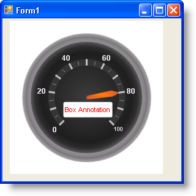

////

|metadata|
{
    "name": "wingauge-box-annotations",
    "controlName": ["WinGauge"],
    "tags": ["Charting"],
    "guid": "{7AD13880-75A7-49EA-AB6D-6F3C05317164}",  
    "buildFlags": [],
    "createdOn": "0001-01-01T00:00:00Z"
}
|metadata|
////

= Box Annotations

Annotations are used to add extra information or to provide a visual cue to your gauge. Box annotations are rectangles, sometimes with rounded edges, with optional text displayed inside.

For example, if you created a Linear gauge to represent a thermometer, you could create an annotation with the text set to Celsius, to show the unit of measurement.

The following screen shot shows an example of a Radial gauge with a box annotation.

== Related Topic

link:wingauge-create-a-box-annotation-on-a-gauge.html[Create a Box Annotation on a Gauge]