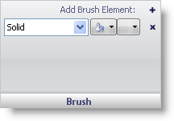

////

|metadata|
{
    "name": "wingauge-brush-pane",
    "controlName": ["WinGauge"],
    "tags": ["Charting"],
    "guid": "{DCC95DEF-81DE-4924-A2BC-C455CE98CCC7}",  
    "buildFlags": [],
    "createdOn": "0001-01-01T00:00:00Z"
}
|metadata|
////

= Brush Pane

The Brush pane lets you customize the brush type and color for your properties.

pick:[win-forms="link:{ApiPlatform}win.ultrawingauge{ApiVersion}~infragistics.ultragauge.resources.labelappearance~brushelement.html[Brush Type]"]  -- This drop-down list lets you change the brush type of your property.

pick:[win-forms="link:{ApiPlatform}win.ultrawingauge{ApiVersion}~infragistics.ultragauge.resources.labelappearance~brushelement.html[Brush Color]"]  -- Depending on which brush type you select, the brush color list will populate with the colors available for that brush type.

Relative Bounds Editor -- This pop-up menu displays two bounds editors, link:wingauge-relative-bounds.html[Relative Bounds] and link:wingauge-relative-clip-bounds.html[Relative Clip Bounds],that allows you to determine the size and location of your brush element.

== Related Topic

link:wingauge-appearance-tab.html[Appearance Tab]