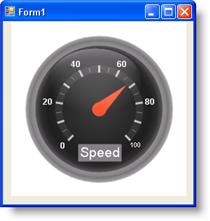
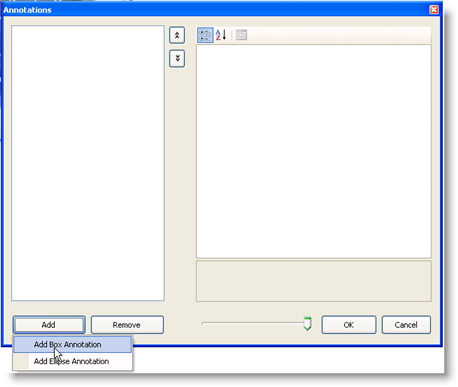
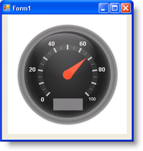

////

|metadata|
{
    "name": "wingauge-create-a-box-annotation-on-a-gauge",
    "controlName": ["WinGauge"],
    "tags": ["Charting"],
    "guid": "{D408B4A0-1FC5-4226-A219-CF40C4B33566}",  
    "buildFlags": [],
    "createdOn": "0001-01-01T00:00:00Z"
}
|metadata|
////

= Create a Box Annotation on a Gauge

Annotations are useful for adding extra information to your gauge. There are many reasons why you would add an annotation to your gauge, for example:

* to highlight a specific area on your gauge.
* to add information that would help the end-user easily understand the scale on your gauge, such as 'Mph' on a Radial gauge that represents a speedometer.
* to add a name to your gauge, such as "Infragistics' Fuel Gauge".

This topic assumes that you have a gauge already created. For information on how to create a gauge, see link:wingauge-getting-started-with-wingauge.html[Getting Started with WinGauge].

You can apply a box annotation on your gauge:

* <<gaugeDesigner,using the Gauge Designer>>
* <<designTime,at design time>>
* <<runTime,at run time>>

When you save and run your application after completing the following steps, your gauge should look similar to the gauge below.

[[gaugeDesigner]]
*To create a box annotation to an existing Radial gauge using the Gauge Designer:*

[start=1]
. In the Gauge Explorer, expand Annotations.
[start=2]
. Click Add Annotation... and select New Box Annotation.
[start=3]
. In the link:wingauge-properties-panel.html[Properties panel], click link:wingauge-annotations-tab.html[Annotations tab]. In the link:wingauge-annotations-bounds-pane.html[Bounds pane], set the following properties:

** X -- 38
** Y -- 70
** Width -- 25
** Height -- 10
** Units -- Percent

[start=4]
. In the link:wingauge-labels-pane.html[Labels pane] of the Annotations tab, set the following property:

** Format String -- Speed

[start=5]
. Click the link:wingauge-appearance-tab.html[Appearance tab.] In the link:wingauge-brush-pane.html[Brush pane], set the following properties:

** Type -- Solid
** Color -- Gray

[start=6]
. Click the link:wingauge-labels-appearance-tab.html[Labels Appearance tab]. In the link:wingauge-brush-pane.html[Brush pane], set the following properties:

** Type -- Solid
** Color -- White

[start=7]
. In the link:wingauge-font-pane.html[Font pane] of the Labels Appearance tab, set the following properties:

** Font -- Arial
** Size -- 14
** Type -- Point

[[designTime]]
*To create a box annotation on your gauge at design time:*

[start=1]
. In the Properties window, click the  pick:[win-forms="link:{ApiPlatform}win.ultrawingauge{ApiVersion}~infragistics.ultragauge.resources.gaugeannotation.html[Annotation]"]  property. Then, click the ellipsis (…) button to open the Annotations collection editor.
[start=2]
. In the Annotations collection editor, click Add, and select Add Box Annotation.

[start=3]
. Create a new BrushElement object by clicking the  pick:[win-forms="link:{ApiPlatform}win.ultrawingauge{ApiVersion}~infragistics.ultragauge.resources.brushelement.html[BrushElement]"]  property in the right-hand pane. Then, from the drop-down list, select Solid Fill.
[start=4]
. Expand the BrushElement property, and set the  pick:[win-forms="link:{ApiPlatform}win.ultrawingauge{ApiVersion}~infragistics.ultragauge.resources.solidfillbrushelement~color.html[Color]"]  property to Gray.
[start=5]
. Expand the  pick:[win-forms="link:{ApiPlatform}win.ultrawingauge{ApiVersion}~infragistics.ultragauge.resources.boundedannotation~bounds.html[Bounds]"]  property to adjust the size of the annotation and to position the annotation on your gauge. Set the X property to 38, the Y property to 70, the Width property to 25, the Height property to 10 and the Units to Percent.
[start=6]
. So far if you run the project, the annotation should look similar to the one in the form below.

[start=7]
. To add text to the annotation, expand the  pick:[win-forms="link:{ApiPlatform}win.ultrawingauge{ApiVersion}~infragistics.ultragauge.resources.radialgaugescale~labels.html[Label]"]  property.
[start=8]
. Create a new BrushElement object by clicking the BrushElement property. Then from the drop-down list, select Solid Fill.
[start=9]
. Expand the BrushElement property, and set the Color property to White.
[start=10]
. Set the  pick:[win-forms="link:{ApiPlatform}win.ultrawingauge{ApiVersion}~infragistics.ultragauge.resources.labelappearance~formatstring.html[FormatString]"]  property to "Speed".
[start=11]
. Expand the  pick:[win-forms="link:{ApiPlatform}win.ultrawingauge{ApiVersion}~infragistics.ultragauge.resources.labelappearance~font.html[Font]"]  property.
[start=12]
. Set Size to 14 and Name to Arial.

[[runTime]]
*To add labels to your scales at run time:*

[start=1]
. Before you start writing any code, you should place using/Imports directives in your code-behind so you don't need to always type out a member's fully qualified name.

*In Visual Basic:*

----
Imports Infragistics.UltraGauge.Resources
----

*In C#:*

----
using Infragistics.UltraGauge.Resources;
----

[start=2]
. Create the load event.
[start=3]
. Create instances of the classes:

*In Visual Basic:*

----
Dim boxAnnotation1 As New BoxAnnotation()
Dim solidFillBrushElement1 As New SolidFillBrushElement()
Dim solidFillBrushElement2 As New SolidFillBrushElement()
----

*In C#:*

----
BoxAnnotation boxAnnotation1 = new BoxAnnotation();
SolidFillBrushElement solidFillBrushElement1 = new SolidFillBrushElement();
SolidFillBrushElement solidFillBrushElement2 = new SolidFillBrushElement();
----

[start=4]
. Set the following the Bound properties:

** X -- 38
** Y -- 70
** Width -- 25
** Height -- 10
** Units -- Percent

*In Visual Basic:*

----
boxAnnotation1.Bounds = New System.Drawing.Rectangle(38, 70, 25, 10)
boxAnnotation1.BoundsMeasure = Infragistics.UltraGauge.Resources.Measure.Percent
----

*In C#:*

----
boxAnnotation1.Bounds = new System.Drawing.Rectangle(38, 70, 25, 10);
boxAnnotation1.BoundsMeasure = Infragistics.UltraGauge.Resources.Measure.Percent;
----

[start=5]
. Set the following the Annotation color properties:

** Type -- Solid
** Color -- Gray

*In Visual Basic:*

----
solidFillBrushElement1.Color = System.Drawing.Color.Gray
boxAnnotation1.BrushElement = solidFillBrushElement1
----

*In C#:*

----
solidFillBrushElement1.Color = System.Drawing.Color.Gray;
boxAnnotation1.BrushElement = solidFillBrushElement1;
----

[start=6]
. Set the following the Font color properties:

** Type -- Solid
** Color -- White

*In Visual Basic:*

----
solidFillBrushElement2.Color = System.Drawing.Color.White
boxAnnotation1.Label.BrushElement = solidFillBrushElement2
----

*In C#:*

----
solidFillBrushElement2.Color = System.Drawing.Color.White;
boxAnnotation1.Label.BrushElement = solidFillBrushElement2;
----

[start=7]
. Set the following the Font properties:

** Font -- Arial
** Size -- 14
** Type -- Point

*In Visual Basic:*

----
boxAnnotation1.Label.Font = New System.Drawing.Font("Arial", 14.0F)
----

*In C#:*

----
boxAnnotation1.Label.Font = new System.Drawing.Font("Arial", 14F);
----

[start=8]
. Set the following the Format string to Speed:

*In Visual Basic:*

----
boxAnnotation1.Label.FormatString = "Speed"
----

*In C#:*

----
boxAnnotation1.Label.FormatString = "Speed";
----

[start=9]
. Add the annotation to your gauge.

*In Visual Basic:*

----
me.UltraGauge1.Annotations.Add(boxAnnotation1)
----

*In C#:*

----
this.ultraGauge1.Annotations.Add(boxAnnotation1);
----