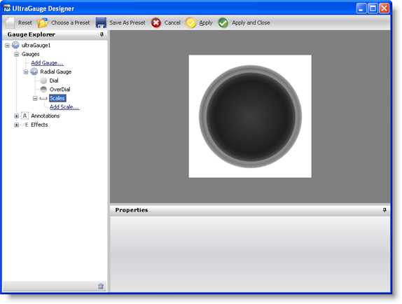
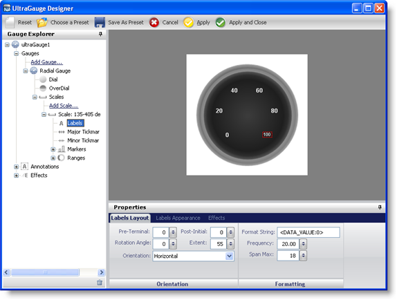
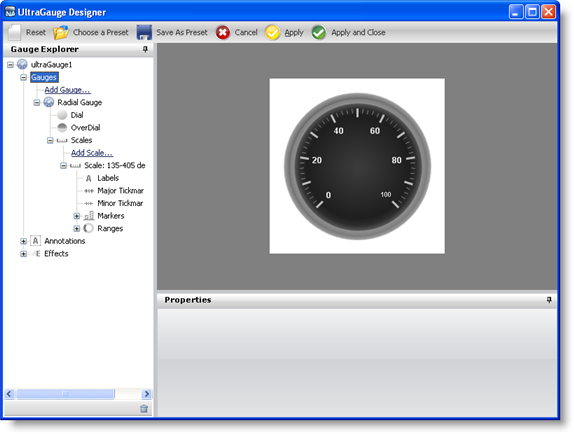

////

|metadata|
{
    "name": "wingauge-creating-a-basic-gauge-using-the-gauge-designer",
    "controlName": ["WinGauge"],
    "tags": [],
    "guid": "{43C10463-E7A5-4E38-BF4F-B5B692FE50D8}",  
    "buildFlags": [],
    "createdOn": "0001-01-01T00:00:00Z"
}
|metadata|
////

= Creating a Basic Gauge Using the Gauge Designer

== Before You Begin

Creating a Radial gauge using the Gauge Designer:

* allows you to save your gauge as a preset and use it for future applications
* allows you to see your gauge as it is being created in the interactive preview area
* simplifies the process of editing the properties on your gauge

== What You Will Accomplish

Using the Gauge Designer to create a basic Radial gauge will help you understand the fundamentals of the Gauge Designer.

== Follow these Steps

[start=1]
. From the toolbox, drag the UltraGauge control to your form. The Gauge Designer opens.

image::images/Gauge_Creating_a_Radial_Gauge_Using_the_Gauge_Designer_01.png[wingauge designer that appears when ultragauge is placed on a form.]

[start=2]
. In the Gauge Explorer, expand Gauges.
[start=3]
. Click Add Gauge... and select New Radial Gauge.
[start=4]
. Expand Radial Gauge and select Dial.
[start=5]
. In the link:wingauge-properties-panel.html[Properties panel], click the link:wingauge-appearance-tab.html[Appearance tab]. In the link:wingauge-brush-pane.html[Brush pane], add the following brush elements with the specified properties:

** link:wingauge-apply-the-multi-stop-radial-gradient-brush-element-using-the-gauge-designer.html[Multi-Stop Radial Gradient brush element]

*** start color -- 161, 161, 161
*** color stop -- 96, 96, 96
*** color stop offset -- 0.4758621
*** end color -- 89, 89, 89

** link:wingauge-apply-the-solid-brush-element-using-the-gauge-designer.html[Solid brush element]

*** color -- Gray

** link:wingauge-apply-the-multi-stop-radial-gradient-brush-element-using-the-gauge-designer.html[Multi-Stop Radial Gradient brush element]

*** start color -- Transparent
*** color stop -- 141, 141, 141
*** color stop offset -- 0.06206897
*** color stop -- 82, 82, 82
*** color stop offset -- 0.07586207
*** color stop -- 45, 45, 45
*** color stop offset -- 0.1448276
*** color stop -- 30, 30, 30
*** color stop offset -- 0.2448276
*** end color -- 60, 60, 60

[start=6]
. In the link:wingauge-stroke-pane.html[Stroke pane] of the Appearance tab set the following properties:

** Type -- Solid
** Details -- Silver
** Style -- Solid
** Thickness -- 1
** Alignment -- Center

[start=7]
. In the Gauge Explorer, expand Scales.
[start=8]
. Click Add Scale... and select New Scale.
[start=9]
. In Properties panel, click the link:wingauge-scale-layout-tab.html[Scale Layout tab]. In the link:wingauge-sweep-angle-pane.html[Sweep Angle pane], set the following properties:

** Start -- 135
** End -- 405

[start=10]
. Click the link:wingauge-axis-pane.html[Axis pane] of the Scale Layout tab and set the End Value to 100.00\.
[start=11]
. In the Gauge Explorer, expand the newly created scale, and select Labels.
[start=12]
. In the Properties panel, click the link:wingauge-labels-layout-tab.html[Labels Layout tab]. In the link:wingauge-orientation-pane.html[Orientation pane], set the following properties:

** Extent -- 55
** Orientation -- Outward

[start=13]
. Click the link:wingauge-formatting-pane.html[Formatting pane] of the Labels Layout tab and set the following properties:

** Frequency -- 20.00
** Span Max -- 18

[start=14]
. Click the Labels Appearance tab. In the Brush pane set the following properties:

** Type -- Solid
** Color -- White

[start=15]
. Click the link:wingauge-font-pane.html[Font pane] of the Labels Appearance tab, and set the following properties:

** Font size -- 12
** Type -- Pixel
** Style -- Bold

[start=16]
. In the Gauge Explorer, select Major Tickmarks.
[start=17]
. In the Properties panel, click the link:wingauge-tickmark-layout-tab.html[Tickmark Layout tab]. In the link:wingauge-tickmark-extent-pane.html[Extent pane] set the following properties:

** Start -- 67
** End -- 79

[start=18]
. Click the link:wingauge-widths-pane.html[Widths pane] of the Tickmark Layout tab, and set the following properties:

** Start -- 3
** End -- 3

[start=19]
. Click the link:wingauge-tickmark-orientation-pane.html[Orientation pane] of the Tickmark Layout tab, and set the following property:

** Frequency -- 10.00

[start=20]
. Click the Appearance tab. In the Brush pane, set the following properties:

** Type -- Solid
** Color -- 189, 189, 189

[start=21]
. In the Gauge Explorer, select Minor Tickmarks.
[start=22]
. In the Properties Panel, click the Tickmark Layout tab. In the Extent pane, set the following properties:

** Start -- 73
** End -- 78

[start=23]
. In the Widths pane of the Tickmark Layout tab, set the following properties:

** Start -- 1
** End -- 1

[start=24]
. In the Orientation pane of the Tickmark Layout tab, set the following property:

** Frequency -- 2.00

[start=25]
. Click the Appearance tab. In the Brush pane, set the following properties:

** Type -- Solid
** Color -- 240, 240, 240

[start=26]
. In the Stroke pane of the Appearance tab, set the following properties:

** Type -- Solid
** Color -- 135, 135, 135

[start=27]
. In the Gauge Explorer, expand Markers.
[start=28]
. Click Add Marker... and select New Needle.
[start=29]
. In the Properties Panel, click the link:wingauge-needle-marker-layout-tab.html[Needle Marker Layout tab]. In the link:wingauge-widths-and-extents-pane.html[Widths and Extents pane], set the following properties:

** Widths

*** Start -- 3
*** Mid -- 3
*** End -- 1

** Extents

*** Start -- -20
*** Mid -- 0
*** End -- 65

[start=30]
. In the link:wingauge-value-and-units.html[Value and Units pane] of the Needle Marker Layout tab, set the following properties:

** Value -- 95.00
** Precision -- 1.00
** Units -- Percent

[start=31]
. Click the Appearance tab. In the Brush pane, set the following properties:

** Type -- Solid
** Color -- 255, 61, 22

[start=32]
. In the Gauge Explorer, expand the newly created needle marker, and select Anchor.
[start=33]
. In the Properties panel, click the Appearance tab. In the Brush pane, set the following properties:

** Type -- SimpleGradient
** Start Color -- Gainsboro
** End Color -- 64, 64, 64
** Gradient Style -- BackwardDiagonal

[start=34]
. In the Stroke pane of the Appearance tab, set the following properties:

** Type -- RadialGradient
** SurroundColor -- Gray
** CenterColor -- WhiteSmoke
** FocusScale -- 0,0
** CenterPoint -- 75, 25

[start=35]
. You have now successfully created a basic Radial gauge using the Gauge Designer. Your gauge should look like the gauge in the following screen shot.

image::images/Gauge_Creating_Basic_Gauge_Using_Gauge_Designer_01.png[finished basic radial gauge created using the designer.]

== Related Topic

link:wingauge-creating-a-complex-gauge-using-the-gauge-designer.html[Creating a Complex Gauge Using the Gauge Designer]