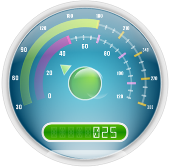

////

|metadata|
{
    "name": "wingauge-creating-a-complex-gauge-using-the-gauge-designer",
    "controlName": ["WinGauge"],
    "tags": ["Charting","Design Environment"],
    "guid": "{06050E4F-B27D-4EEB-8C8F-613C944080C5}",  
    "buildFlags": [],
    "createdOn": "0001-01-01T00:00:00Z"
}
|metadata|
////

= Creating a Complex Gauge Using the Gauge Designer

You can use the link:wingauge-designer.html[Gauge Designer] to create complex gauges that can consist of multiple gauges containing multiple scales, ranges and markers.

The following topics comprise of a multi-part walkthrough that guides you through the process of creating a complex Radial gauge containing a Digital gauge using the Designer:

* link:wingauge-creating-a-complex-gauge-using-the-gauge-designer-part-1-of-5.html[Creating a Complex Gauge Using the Gauge Designer (Part 1 of 5)]
* link:wingauge-creating-a-complex-gauge-using-the-gauge-designer-part-2-of-5.html[Creating a Complex Gauge Using the Gauge Designer (Part 2 of 5)]
* link:wingauge-creating-a-complex-gauge-using-the-gauge-designer-part-3-of-5.html[Creating a Complex Gauge Using the Gauge Designer (Part 3 of 5)]
* link:wingauge-creating-a-complex-gauge-using-the-gauge-designer-part-4-of-5.html[Creating a Complex Gauge Using the Gauge Designer (Part 4 of 5)]
* link:wingauge-creating-a-complex-gauge-using-the-gauge-designer-part-5-of-5.html[Creating a Complex Gauge Using the Gauge Designer (Part 5 of 5)]

At the end of the multi-part walkthrough, you will have created a gauge similar to the screen shot below.

