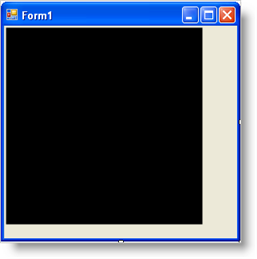

////

|metadata|
{
    "name": "wingauge-creating-a-digital-gauge-in-design-view",
    "controlName": ["WinGauge"],
    "tags": [],
    "guid": "{9472EDF2-E599-4D85-88C2-D5394D63A177}",  
    "buildFlags": [],
    "createdOn": "0001-01-01T00:00:00Z"
}
|metadata|
////

= Creating a Digital Gauge in Design View

Digital gauges visually represent data similar to a digital watch or a digital alarm clock.

*To add a Digital gauge to the WinGauge*control:*

[start=1]
. From the toolbox, drag the UltraGauge control to your form.
[start=2]
. In the Properties window, click the  pick:[win-forms="link:{ApiPlatform}win.ultrawingauge{ApiVersion}~infragistics.win.ultrawingauge.ultragauge~gauges.html[Gauges]"]  property. Then, click the ellipsis (…) button to open the Gauges collection editor.
[start=3]
. In the Gauges collection editor, click Add, and select Add Segmented Digital Gauge.

image::images/Gauge_Adding_Digital_Gauge_01.png[WinGauge's gauge's collection editor.]

[start=4]
. At this point, the Digital Gauge has been added, but it is not visible because you have not set the specific properties. To start configuring the Gauge control, expand the Misc property.
[start=5]
. Create a new BrushElement object by clicking the  pick:[win-forms="link:{ApiPlatform}win.ultrawingauge{ApiVersion}~infragistics.ultragauge.resources.dialappearance~brushelement.html[BrushElement]"]  property. Then, from the drop-down list, select Solid Fill.
[start=6]
. Expand the BrushElement property, and set the  pick:[win-forms="link:{ApiPlatform}win.ultrawingauge{ApiVersion}~infragistics.ultragauge.resources.colorstop~color.html[Color]"]  property to Black.
[start=7]
. At this point, you should see the Digital Gauge.

[start=8]
. Resize the gauge by expanding the  pick:[win-forms="link:{ApiPlatform}win.ultrawingauge{ApiVersion}~infragistics.ultragauge.resources.gauge~bounds.html[Bounds]"]  property. Set the Width property to 250, and the Height property to 100\.
[start=9]
. Set the  pick:[win-forms="link:{ApiPlatform}win.ultrawingauge{ApiVersion}~infragistics.ultragauge.resources.digitalgauge~digits.html[Digits]"]  property to 4.
[start=10]
. Create a new FontBrushElement object by clicking the  pick:[win-forms="link:{ApiPlatform}win.ultrawingauge{ApiVersion}~infragistics.ultragauge.resources.digitalgauge~fontbrushelement.html[FontBrushElement]"]  property. Then, from the drop-down list, select Solid Fill.
[start=11]
. Expand the FontBrushElement property, and set the Color property to GreenYellow.
[start=12]
. Create a new UnlitBrushElement object by clicking the  pick:[win-forms="link:{ApiPlatform}win.ultrawingauge{ApiVersion}~infragistics.ultragauge.resources.segmenteddigitalgauge~unlitbrushelement.html[UnlitBrushElement]"]  property. Then, from the drop-down list, select Solid Fill.
[start=13]
. Expand the UnlitBrushElement property, and set the Color property to DarkGreen.
[start=14]
. Set the  pick:[win-forms="link:{ApiPlatform}win.ultrawingauge{ApiVersion}~infragistics.ultragauge.resources.digitalgauge~text.html[Text]"]  property to 1234.
[start=15]
. Run the project. It should look similar to the form below.

