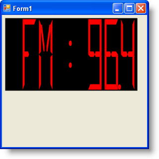

////

|metadata|
{
    "name": "wingauge-creating-a-digital-gauge-using-code",
    "controlName": ["WinGauge"],
    "tags": [],
    "guid": "{BA0C9C4A-0A2D-47A2-AA08-F230FBA7B46C}",  
    "buildFlags": [],
    "createdOn": "0001-01-01T00:00:00Z"
}
|metadata|
////

= Creating a Digital Gauge Using Code

This tutorial walks you through the process of creating a Digital gauge using code. At the end of this walkthrough, you will have created a Digital gauge that represents a digital radio.

*To create a Digital gauge using code:*

[start=1]
. Before you start writing any code, you should place using/Imports directives in your code-behind so you don't need to always type out a member's fully qualified name.

*In Visual Basic:*

----
Imports Infragistics.UltraGauge.Resources
----

*In C#:*

----
using Infragistics.UltraGauge.Resources;
----

[start=2]
. Create an instance of a Digital gauge and the brush element instances.

*In Visual Basic:*

----
Dim ultraGauge1 As New Infragistics.Win.UltraWinGauge.UltraGauge()
Dim myDigitalGauge As New SegmentedDigitalGauge()
Dim mySolidFillBrushElement As New SolidFillBrushElement()
Dim mySolidFillBrushElement1 As New SolidFillBrushElement()
----

*In C#:*

----
Infragistics.Win.UltraWinGauge.UltraGauge ultraGauge1 = 
  new Infragistics.Win.UltraWinGauge.UltraGauge();
SegmentedDigitalGauge myDigitalGauge = new SegmentedDigitalGauge();
SolidFillBrushElement mySolidFillBrushElement = new SolidFillBrushElement();
SolidFillBrushElement mySolidFillBrushElement1 = new SolidFillBrushElement();
----

[start=3]
. Set the background color to Black.

*In Visual Basic:*

----
mySolidFillBrushElement.Color = System.Drawing.Color.Black
myDigitalGauge.BrushElement = mySolidFillBrushElement
----

*In C#:*

----
mySolidFillBrushElement.Color = System.Drawing.Color.Black;
myDigitalGauge.BrushElement = mySolidFillBrushElement;
----

[start=4]
. Set the number of digits.

*In Visual Basic:*

----
myDigitalGauge.Digits = 8
----

*In C#:*

----
myDigitalGauge.Digits = 8;
----

[start=5]
. Set the font color to Red.

*In Visual Basic:*

----
mySolidFillBrushElement1.Color = System.Drawing.Color.Red
myDigitalGauge.FontBrushElement = mySolidFillBrushElement1
----

*In C#:*

----
mySolidFillBrushElement1.Color = System.Drawing.Color.Red;
myDigitalGauge.FontBrushElement = mySolidFillBrushElement1;
----

[start=6]
. Set the mode to 14-segment and the digit text to FM : 96.4.

*In Visual Basic:*

----
myDigitalGauge.Mode = SegmentMode.FourteenSegment
myDigitalGauge.Text = "FM : 96.4"
----

*In C#:*

----
myDigitalGauge.Mode = SegmentMode.FourteenSegment;
myDigitalGauge.Text = "FM : 96.4";
----

[start=7]
. Add the Digital gauge to the Gauges collection. Set the following properties for your gauge:

** Location = (4, 4)
** Name = ultraGauge
** Size = (270, 150)
** TabIndex = 0

*In Visual Basic:*

----
ultraGauge1.Gauges.Add(myDigitalGauge)
ultraGauge1.Location = New System.Drawing.Point(4, 4)
ultraGauge1.Name = "ultraGauge1"
ultraGauge1.Size = New System.Drawing.Size(270, 150)
ultraGauge1.TabIndex = 0
Me.Controls.Add(ultraGauge1)
----

*In C#:*

----
ultraGauge1.Gauges.Add(myDigitalGauge);
ultraGauge1.Location = new System.Drawing.Point(4, 4);
ultraGauge1.Name = "ultraGauge1";
ultraGauge1.Size = new System.Drawing.Size(270, 150);
ultraGauge1.TabIndex = 0;
this.Controls.Add(ultraGauge1);
----

[start=8]
. Save and run the application. It should look similar to the form below.

