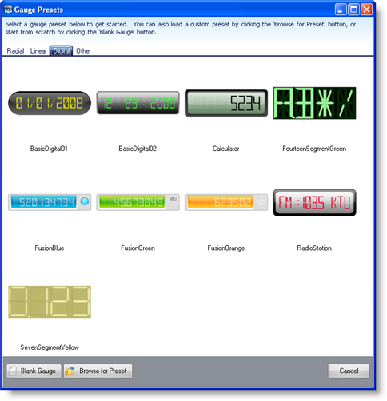
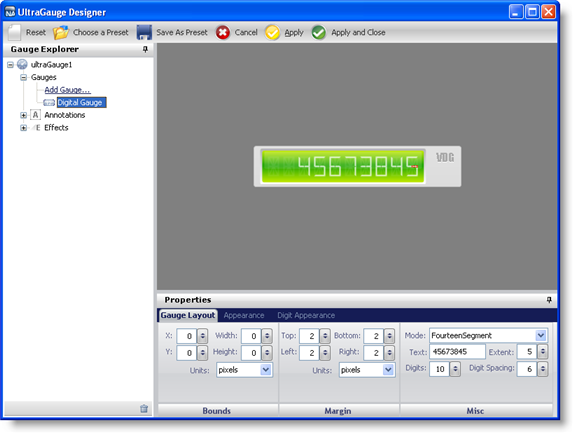
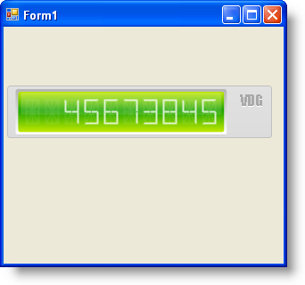

////

|metadata|
{
    "name": "wingauge-creating-a-digital-gauge-using-the-gauge-presets",
    "controlName": ["WinGauge"],
    "tags": [],
    "guid": "{B22A3695-E588-4C4A-86C1-B5056DB1B4A4}",  
    "buildFlags": [],
    "createdOn": "0001-01-01T00:00:00Z"
}
|metadata|
////

= Creating a Digital Gauge Using the Gauge Presets

== Before You Begin

Creating a Digital gauge using the Gauge Designer allows you to use predefined presets, therefore minimizing the work required to create Digital gauges.

== What You Will Accomplish

Using the Gauge Designer to create Digital gauges will help you create visually appealing and professional-looking gauges such as odometers.

== Follow these Steps

[start=1]
. From the toolbox, drag the UltraGauge control to your form. The Gauge Designer opens.

image::images/Gauge_Creating_a_Digital_Gauge_Using_the_Gauge_Designer_01.png[WinGauge designer that appears when you place ultragauge on a form.]

[start=2]
. On the Toolbar, click Open Presets.
[start=3]
. Click the Digital tab.

[start=4]
. Select a predefined Digital gauge. When you select a gauge it appears in the interactive preview area.

[start=5]
. To create a Digital gauge using the selected preset without closing the Gauge Designer, click Apply. To create a Digital gauge using the selected preset and automatically close the designer, click Apply and Close.
[start=6]
. Run the application. It should look similar to the form below.

