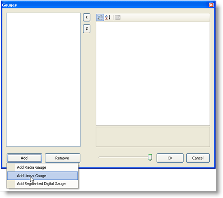
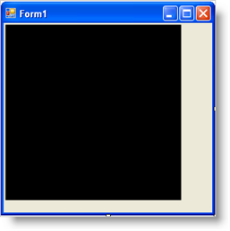
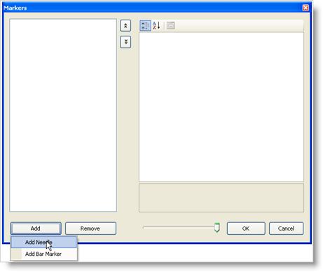
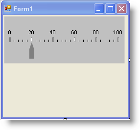

////

|metadata|
{
    "name": "wingauge-creating-a-linear-gauge-in-design-view",
    "controlName": ["WinGauge"],
    "tags": ["Charting","Design Environment"],
    "guid": "{E2D840E5-6222-4B4B-ADEB-9647A28377BD}",  
    "buildFlags": [],
    "createdOn": "0001-01-01T00:00:00Z"
}
|metadata|
////

= Creating a Linear Gauge in Design View

You can use Linear gauges to visually represent information that increases/decreases (e.g., temperature).

*To add a Linear gauge to the WinGauge control:*

[start=1]
. In Design view, click the UltraGauge control on your form.
[start=2]
. In the Properties window, click the  pick:[win-forms="link:{ApiPlatform}win.ultrawingauge{ApiVersion}~infragistics.win.ultrawingauge.ultragauge~gauges.html[Gauges]"]  property. Then, click the ellipsis (…) button to open the Gauges collection editor.
[start=3]
. In the Gauges collection editor, click Add, and select Add Linear Gauge.

[start=4]
. At this point, the Linear Gauge has been added, but it is not visible because you haven't set specific properties. To start configuring the Gauge, expand the Misc property.
[start=5]
. Create a new BrushElement object by clicking the  pick:[win-forms="link:{ApiPlatform}win.ultrawingauge{ApiVersion}~infragistics.ultragauge.resources.dialappearance~brushelement.html[BrushElement]"]  property. Then from the drop-down list, select Solid Fill.
[start=6]
. Expand the BrushElement property, and set the  pick:[win-forms="link:{ApiPlatform}win.ultrawingauge{ApiVersion}~infragistics.ultragauge.resources.colorstop~color.html[Color]"]  property to Silver.
[start=7]
. At this point, you should see the Linear gauge.

[start=8]
. Resize the gauge by expanding the  pick:[win-forms="link:{ApiPlatform}win.ultrawingauge{ApiVersion}~infragistics.ultragauge.resources.gauge~bounds.html[Bounds]"]  property. Set the Width property to 250, and the Height property to 100\.
[start=9]
. Create a new Scale by clicking the  pick:[win-forms="link:{ApiPlatform}win.ultrawingauge{ApiVersion}~infragistics.ultragauge.resources.lineargauge~scales.html[Scales]"]  property . Then click the ellipsis (…) button to open the Scale cCollection editor.
[start=10]
. Click Add to create a new Scale.
[start=11]
. Create a new Axis object by clicking the  pick:[win-forms="link:{ApiPlatform}win.ultrawingauge{ApiVersion}~infragistics.ultragauge.resources.axis.html[Axis]"]  property of the Scale. Then, from the drop-down list, select Numeric Axis.
[start=12]
. Expand the Axis property, and set the  pick:[win-forms="link:{ApiPlatform}win.ultrawingauge{ApiVersion}~infragistics.ultragauge.resources.gaugerange~startvalue.html[StartValue]"]  property to 0. Then set the  pick:[win-forms="link:{ApiPlatform}win.ultrawingauge{ApiVersion}~infragistics.ultragauge.resources.gaugerange~endvalue.html[EndValue]"]  property to 100\.
[start=13]
. Add major tick marks to the Scale by expanding the  pick:[win-forms="link:{ApiPlatform}win.ultrawingauge{ApiVersion}~infragistics.ultragauge.resources.lineargaugescale~majortickmarks.html[MajorTickmarks]"]  property. Then, create a new brush element by clicking the  pick:[win-forms="link:{ApiPlatform}win.ultrawingauge{ApiVersion}~infragistics.ultragauge.resources.gaugerange~brushelement.html[BrushElement]"]  property, and from the drop-down list, selecting Solid Fill.
[start=14]
. Expand the BrushElement property, and set the  pick:[win-forms="link:{ApiPlatform}win.ultrawingauge{ApiVersion}~infragistics.ultragauge.resources.solidfillbrushelement~color.html[Color]"]  property to White.
[start=15]
. In order to align the outer edge of the tick marks, set the  pick:[win-forms="link:{ApiPlatform}win.ultrawingauge{ApiVersion}~infragistics.ultragauge.resources.lineargaugescale~endextent.html[EndExtent]"]  property to 55.
[start=16]
. You must also change the  pick:[win-forms="link:{ApiPlatform}win.ultrawingauge{ApiVersion}~infragistics.ultragauge.resources.lineargaugescale~startextent.html[StartExtent]"]  property so that its value is less than the EndExtent property. Set the StartExtent property to 45.
[start=17]
. Set the  pick:[win-forms="link:{ApiPlatform}win.ultrawingauge{ApiVersion}~infragistics.ultragauge.resources.lineargaugescaletickmarkappearance~startwidth.html[StartWidth]"]  property to 2 and the  pick:[win-forms="link:{ApiPlatform}win.ultrawingauge{ApiVersion}~infragistics.ultragauge.resources.lineargaugescaletickmarkappearance~endwidth.html[EndWidth]"]  property to 2.
[start=18]
. Set the stroke element of the major tick marks by expanding the  pick:[win-forms="link:{ApiPlatform}win.ultrawingauge{ApiVersion}~infragistics.ultragauge.resources.strokeelement.html[StrokeElement]"]  property, and setting the color to Gray.
[start=19]
. Add minor tick marks to the scale by expanding the  pick:[win-forms="link:{ApiPlatform}win.ultrawingauge{ApiVersion}~infragistics.ultragauge.resources.lineargaugescale~minortickmarks.html[MinorTickmarks]"]  property.
[start=20]
. Expand the StrokeElement property, and set the Color property to Black.
[start=21]
. In order to align the outer edge of the tick marks, set the EndExtent property to 50\.
[start=22]
. You must also change the StartExtent property so that its value is less than the EndExtent property. Set the StartExtent property to 45.
[start=23]
. Set the StartWidth property to 1, the EndWidth property to 1 and the Frequency property to 0.2.
[start=24]
. Add a label to the scale by expanding the  pick:[win-forms="link:{ApiPlatform}win.ultrawingauge{ApiVersion}~infragistics.ultragauge.resources.labelappearance.html[Label]"]  property. Then, create a new brush element by clicking the BrushElement property, and from the drop-down list, selecting Solid Fill.
[start=25]
. Expand the BrushElement property, and set the Color property to White.
[start=26]
. Set the Extent property to 65 and the  pick:[win-forms="link:{ApiPlatform}win.ultrawingauge{ApiVersion}~infragistics.ultragauge.resources.lineargaugescalelabelsappearance~zposition.html[ZPosition]"]  property to AboveMarkers.
[start=27]
. Now all that is needed is a marker that indicates the current value that should be displayed. Click the  pick:[win-forms="link:{ApiPlatform}win.ultrawingauge{ApiVersion}~infragistics.ultragauge.resources.lineargaugescale~markers.html[Markers]"]  property of the scale, and click the ellipsis (…) button to open the Markers collection editor.

[start=28]
. Click Add and select Add Needle.
[start=29]
. The needle has now been added but is not visible because you have not created a brush element.
[start=30]
. Create a new BrushElement object by clicking the BrushElement property. Then from the drop-down list, select Solid Fill.
[start=31]
. Expand the BrushElement property, and set the Color property to Gray.
[start=32]
. The needle is still not visible because you have not specified its value. Set the Value property to 20\.
[start=33]
. Set the StartExtent property to 10, the EndExtent property to 45, and the MidExtent MidExtent property to 30\.
[start=34]
. Run the project. It should look similar to the form below.

