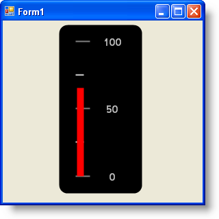

////

|metadata|
{
    "name": "wingauge-creating-a-linear-gauge-using-code",
    "controlName": ["WinGauge"],
    "tags": [],
    "guid": "{DE6615CD-8CCF-4FC7-9F74-B311CD4F8693}",  
    "buildFlags": [],
    "createdOn": "0001-01-01T00:00:00Z"
}
|metadata|
////

= Creating a Linear Gauge Using Code

This tutorial walks you through the process of creating a Linear gauge using code. At the end of this walkthrough, you will have created a Linear gauge with a bar marker.

*To create a Linear gauge using code:*

[start=1]
. Before you start writing any code, you should place using/Imports directives in your code-behind so you don't need to always type out a member's fully qualified name.

*In Visual Basic:*

----
Imports Infragistics.UltraGauge.Resources
----

*In C#:*

----
using Infragistics.UltraGauge.Resources;
----

[start=2]
. Instantiate the following classes:

*In Visual Basic:*

----
Dim ultraGauge1 As New Infragistics.Win.UltraWinGauge.UltraGauge()
Dim myLinearGauge As New LinearGauge()
Dim myScale As New LinearGaugeScale()
Dim numericAxis1 As New NumericAxis()
Dim myMarker As New LinearGaugeBarMarker()
Dim mySolidFillBrushElement1 As New SolidFillBrushElement()
Dim mySolidFillBrushElement2 As New SolidFillBrushElement()
Dim mySolidFillBrushElement3 As New SolidFillBrushElement()
Dim mySolidFillBrushElement4 As New SolidFillBrushElement()
Dim mySolidFillBrushElement5 As New SolidFillBrushElement()
Dim mySolidFillBrushElement6 As New SolidFillBrushElement()
----

*In C#:*

----
Infragistics.Win.UltraWinGauge.UltraGauge ultraGauge1 = 
  new Infragistics.Win.UltraWinGauge.UltraGauge();
LinearGauge myLinearGauge = new LinearGauge();
LinearGaugeScale myScale = new LinearGaugeScale();
NumericAxis numericAxis1 = new NumericAxis();
LinearGaugeBarMarker myMarker = new LinearGaugeBarMarker();
SolidFillBrushElement mySolidFillBrushElement1 = new SolidFillBrushElement();
SolidFillBrushElement mySolidFillBrushElement2 = new SolidFillBrushElement();
SolidFillBrushElement mySolidFillBrushElement3 = new SolidFillBrushElement();
SolidFillBrushElement mySolidFillBrushElement4 = new SolidFillBrushElement();
SolidFillBrushElement mySolidFillBrushElement5 = new SolidFillBrushElement();
SolidFillBrushElement mySolidFillBrushElement6 = new SolidFillBrushElement();
----

[start=3]
. Set the background color to Black .

*In Visual Basic:*

----
mySolidFillBrushElement1.Color = System.Drawing.Color.Black
myLinearGauge.BrushElement = mySolidFillBrushElement1
----

*In C#:*

----
mySolidFillBrushElement1.Color = System.Drawing.Color.Black;
myLinearGauge.BrushElement = mySolidFillBrushElement1;
----

[start=4]
. Set the corner extent and orientation of your Linear gauge

*In Visual Basic:*

----
myLinearGauge.CornerExtent = 10
myLinearGauge.Orientation = LinearOrientation.Vertical
----

*In C#:*

----
myLinearGauge.CornerExtent = 10;
myLinearGauge.Orientation = LinearOrientation.Vertical;
----

[start=5]
. Set the end value of the axis to 100

*In Visual Basic:*

----
numericAxis1.EndValue = 100
myScale.Axes.Add(numericAxis1)
----

*In C#:*

----
numericAxis1.EndValue = 100;
myScale.Axes.Add(numericAxis1);
----

[start=6]
. Set the following *Scale* properties:

** *Color* -- Gray
** *EndExtent* -- 90
** *InnerExtent* -- 20
** *OuterExtent* -- 30
** *StartExtent* -- 10

*In Visual Basic:*

----
mySolidFillBrushElement2.Color = System.Drawing.Color.Gray
myLinearGauge.BrushElement = mySolidFillBrushElement2
myScale.EndExtent = 90
myScale.InnerExtent = 20
myScale.StartExtent = 10
myScale.OuterExtent = 30
----

*In C#:*

----
mySolidFillBrushElement2.Color = System.Drawing.Color.Gray;
myLinearGauge.BrushElement = mySolidFillBrushElement2;
myScale.EndExtent = 90;
myScale.InnerExtent = 20;
myScale.StartExtent = 10;
myScale.OuterExtent = 30;
----

[start=7]
. Set the following *Labels* properties:

** *Color* -- Silver
** *Extent* -- 65
** *Font* -- Trebuchet MS
** *Frequency* -- 50

*In Visual Basic:*

----
mySolidFillBrushElement3.Color = System.Drawing.Color.Silver
myScale.Labels.BrushElement = mySolidFillBrushElement3
myScale.Labels.Extent = 65
myScale.Labels.Font = _
  New System.Drawing.Font("Trebuchet MS", 12.0F, _
  System.Drawing.FontStyle.Bold)
myScale.Labels.Frequency = 50
----

*In C#:*

----
mySolidFillBrushElement3.Color = System.Drawing.Color.Silver;
myScale.Labels.BrushElement = mySolidFillBrushElement3;
myScale.Labels.Extent = 65;
myScale.Labels.Font = 
  new System.Drawing.Font("Trebuchet MS", 12F, 
  System.Drawing.FontStyle.Bold);
myScale.Labels.Frequency = 50;
----

[start=8]
. Set the following major *Tickmark* properties:

** *Color* -- Gray
** *EndExtent* -- 38
** *EndWidth* -- 2
** *Frequency* -- 50
** *StartExtent* -- 20
** *StartWidth* -- 2

*In Visual Basic:*

----
mySolidFillBrushElement4.Color = System.Drawing.Color.Gray
myScale.MajorTickmarks.BrushElement = mySolidFillBrushElement4
myScale.MajorTickmarks.EndExtent = 38
myScale.MajorTickmarks.EndWidth = 2
myScale.MajorTickmarks.Frequency = 50
myScale.MajorTickmarks.StartExtent = 20
myScale.MajorTickmarks.StartWidth = 2
----

*In C#:*

----
mySolidFillBrushElement4.Color = System.Drawing.Color.Gray;
myScale.MajorTickmarks.BrushElement = mySolidFillBrushElement4;
myScale.MajorTickmarks.EndExtent = 38;
myScale.MajorTickmarks.EndWidth = 2;
myScale.MajorTickmarks.Frequency = 50;
myScale.MajorTickmarks.StartExtent = 20;
myScale.MajorTickmarks.StartWidth = 2;
----

[start=9]
. Set the following minor *Tickmark* properties:

** *Color* -- LightGray
** *EndExtent* -- 30
** *EndWidth* -- 2
** *Frequency* -- 25
** *StartExtent* -- 20
** *StartWidth* -- 2

*In Visual Basic:*

----
mySolidFillBrushElement6.Color = System.Drawing.Color.LightGray
myScale.MinorTickmarks.BrushElement = mySolidFillBrushElement6
myScale.MinorTickmarks.EndExtent = 30
myScale.MinorTickmarks.EndWidth = 2
myScale.MinorTickmarks.Frequency = 25
myScale.MinorTickmarks.StartExtent = 20
myScale.MinorTickmarks.StartWidth = 2
----

*In C#:*

----
mySolidFillBrushElement6.Color = System.Drawing.Color.LightGray;
myScale.MinorTickmarks.BrushElement = mySolidFillBrushElement6;
myScale.MinorTickmarks.EndExtent = 30;
myScale.MinorTickmarks.EndWidth = 2;
myScale.MinorTickmarks.Frequency = 25;
myScale.MinorTickmarks.StartExtent = 20;
myScale.MinorTickmarks.StartWidth = 2;
----

[start=10]
. Set the following *Marker* properties:

** *Color* -- Red
** *InnerExtent* -- 20
** *OuterExtent* -- 100
** *SegmentSpan* -- 1
** *StartExtent* -- 0
** *Value* -- 65

*In Visual Basic:*

----
mySolidFillBrushElement5.Color = System.Drawing.Color.Red
myMarker.BrushElement = mySolidFillBrushElement5
myMarker.InnerExtent = 20
myMarker.OuterExtent = 100
myMarker.SegmentSpan = 1
myMarker.StartExtent = 0
myMarker.Value = 65
myScale.Markers.Add(myMarker)
----

*In C#:*

----
mySolidFillBrushElement5.Color = System.Drawing.Color.Red;
myMarker.BrushElement = mySolidFillBrushElement5;
myMarker.InnerExtent = 20;
myMarker.OuterExtent = 100;
myMarker.SegmentSpan = 1;
myMarker.StartExtent = 0;
myMarker.Value = 65;
myScale.Markers.Add(myMarker);
----

[start=11]
. Add your scale to the scales collection and your gauge to the Gauges collection. Set the following properties for your gauge:

** Location = (80, 4)
** Name = ultraGauge
** Size = (125, 250)
** TabIndex = 0

*In Visual Basic:*

----
myLinearGauge.Scales.Add(myScale)
ultraGauge1.Gauges.Add(myLinearGauge)
ultraGauge1.Location = New System.Drawing.Point(80, 4)
ultraGauge1.Name = "ultraGauge1"
ultraGauge1.Size = New System.Drawing.Size(125, 250)
ultraGauge1.TabIndex = 0
Me.Controls.Add(ultraGauge1)
----

*In C#:*

----
myLinearGauge.Scales.Add(myScale);
ultraGauge1.Gauges.Add(myLinearGauge);
ultraGauge1.Location = new System.Drawing.Point(80, 4);
ultraGauge1.Name = "ultraGauge1";
ultraGauge1.Size = new System.Drawing.Size(125, 250);
ultraGauge1.TabIndex = 0;
this.Controls.Add(ultraGauge1);
----

[start=12]
. Save and run the application. It should look similar to the form below.

