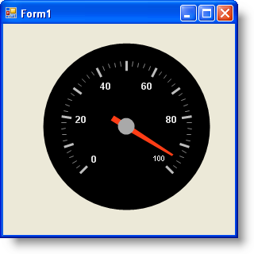

////

|metadata|
{
    "name": "wingauge-creating-a-radial-gauge-using-code",
    "controlName": ["WinGauge"],
    "tags": ["Charting"],
    "guid": "{0B67A33A-1A3B-4F83-A3BE-A9A5E04F9F05}",  
    "buildFlags": [],
    "createdOn": "0001-01-01T00:00:00Z"
}
|metadata|
////

= Creating a Radial Gauge Using Code

This tutorial walks you through the process of creating a Radial gauge using code. At the end of this walkthrough, you will have created a Radial gauge with a needle marker.

*To create a Radial gauge using code:*

[start=1]
. Before you start writing any code, you should place using/Imports directives in your code-behind so you don't need to always type out a member's fully qualified name.

*In Visual Basic:*

----
Imports Infragistics.UltraGauge.Resources
----

*In C#:*

----
using Infragistics.UltraGauge.Resources;
----

[start=2]
. Instantiate the following classes:

*In Visual Basic:*

----
Dim ultraGauge1 As New Infragistics.Win.UltraWinGauge.UltraGauge()
Dim myRadialGauge As New RadialGauge()
Dim myScale As New RadialGaugeScale()
Dim numericAxis1 As New NumericAxis()
Dim myNeedle As New RadialGaugeNeedle()
Dim mySolidFillBrushElement As New SolidFillBrushElement()
Dim mySolidFillBrushElementMajor As New SolidFillBrushElement()
Dim mySolidFillBrushElementMinor As New SolidFillBrushElement()
Dim mySolidFillBrushElementMinorStroke As New SolidFillBrushElement()
Dim myStrokeElement As New StrokeElement()
Dim mySolidFillBrushElement2 As New SolidFillBrushElement()
Dim mySimpleGradientBrushElement As New SimpleGradientBrushElement()
Dim mySolidFillBrushElement1 As New SolidFillBrushElement()
----

*In C#:*

----
Infragistics.Win.UltraWinGauge.UltraGauge ultraGauge1 = 
  new Infragistics.Win.UltraWinGauge.UltraGauge();
RadialGauge myRadialGauge = new RadialGauge();
RadialGaugeScale myScale = new RadialGaugeScale();
NumericAxis numericAxis1 = new NumericAxis();
RadialGaugeNeedle myNeedle = new RadialGaugeNeedle();
SolidFillBrushElement mySolidFillBrushElement = new SolidFillBrushElement();
SolidFillBrushElement mySolidFillBrushElementMajor = 
  new SolidFillBrushElement();
SolidFillBrushElement mySolidFillBrushElementMinor = 
  new SolidFillBrushElement();
SolidFillBrushElement mySolidFillBrushElementMinorStroke = 
  new SolidFillBrushElement();
StrokeElement myStrokeElement = new StrokeElement();
SolidFillBrushElement mySolidFillBrushElement2 = new SolidFillBrushElement();
SimpleGradientBrushElement mySimpleGradientBrushElement = 
  new SimpleGradientBrushElement();
SolidFillBrushElement mySolidFillBrushElement1 = new SolidFillBrushElement();           
----

[start=3]
. Set the background color of the Dial property to Black.

*In Visual Basic:*

----
mySolidFillBrushElement.Color = System.Drawing.Color.Black
myRadialGauge.Dial.BrushElement = mySolidFillBrushElement     
----

*In C#:*

----
mySolidFillBrushElement.Color = System.Drawing.Color.Black;
myRadialGauge.Dial.BrushElement = mySolidFillBrushElement;
----

[start=4]
. Set following the Margin properties:

** x = 10
** y = 10
** top = 10
** bottom = 10
** unit = pixels

*In Visual Basic:*

----
myRadialGauge.Margin = New Margin(10, 10, 10, 10, Measure.Pixels)
----

*In C#:*

----
myRadialGauge.Margin = new Margin(10, 10, 10, 10, Measure.Pixels);
----

[start=5]
. Set the following *Axis* properties and add the Axis to your scale:

** EndValue = 100
** Type = Numeric

*In Visual Basic:*

----
numericAxis1.EndValue = 100
myScale.Axes.Add(numericAxis1)
----

*In C#:*

----
numericAxis1.EndValue = 100;
myScale.Axes.Add(numericAxis1);
----

[start=6]
. Set the following *Scale* properties:

** *StartValue* -- 135
** *EndValue* -- 405

*In Visual Basic:*

----
myScale.EndAngle = 405
myScale.StartAngle = 135
----

*In C#:*

----
myScale.EndAngle = 405;
myScale.StartAngle = 135;
----

[start=7]
. Set the following *Label* properties:

** *Color* -- White
** *Extent* -- 55
** *Font* -- Arial
** *Frequency* -- 20
** *Orientation* -- Horizontal
** *SpanMaximum* -- 18

*In Visual Basic:*

----
mySolidFillBrushElement1.Color = System.Drawing.Color.White
myScale.Labels.BrushElement = mySolidFillBrushElement1
myScale.Labels.Extent = 65
myScale.Labels.Font = _
  New System.Drawing.Font("Arial", 14.0F, 
  System.Drawing.FontStyle.Bold, System.Drawing.GraphicsUnit.Pixel)
myScale.Labels.Frequency = 20
myScale.Labels.Orientation = _
  Infragistics.UltraGauge.Resources.RadialLabelOrientation.Horizontal
myScale.Labels.SpanMaximum = 18
----

*In C#:*

----
mySolidFillBrushElement1.Color = System.Drawing.Color.White;
myScale.Labels.BrushElement = mySolidFillBrushElement1;
myScale.Labels.Extent = 65;
myScale.Labels.Font = 
  new System.Drawing.Font("Arial", 14F, 
  System.Drawing.FontStyle.Bold, System.Drawing.GraphicsUnit.Pixel);
myScale.Labels.Frequency = 20;
myScale.Labels.Orientation = 
  Infragistics.UltraGauge.Resources.RadialLabelOrientation.Horizontal;
myScale.Labels.SpanMaximum = 18;
----

[start=8]
. Set the following major *Tickmark* properties:

** *Color* -- 189, 189, 189
** *EndExtent* -- 79
** *EndWidth* -- 3
** *Frequency* -- 10
** *StartExtent* -- 67
** *StartWidth* -- 3

*In Visual Basic:*

----
mySolidFillBrushElementMajor.Color = _
  System.Drawing.Color.FromArgb(CInt(CByte(189)), CInt(CByte(189)), _
  CInt(CByte(189)))
myScale.MajorTickmarks.BrushElement = mySolidFillBrushElementMajor
myScale.MajorTickmarks.EndExtent = 95
myScale.MajorTickmarks.EndWidth = 3
myScale.MajorTickmarks.Frequency = 10
myScale.MajorTickmarks.StartExtent = 85
myScale.MajorTickmarks.StartWidth = 3
----

*In C#:*

----
mySolidFillBrushElementMajor.Color = 
  System.Drawing.Color.FromArgb(((int)(((byte)(189)))), ((int)(((byte)(189)))), 
  ((int)(((byte)(189)))));
myScale.MajorTickmarks.BrushElement = mySolidFillBrushElementMajor;
myScale.MajorTickmarks.EndExtent = 95;
myScale.MajorTickmarks.EndWidth = 3;
myScale.MajorTickmarks.Frequency = 10;
myScale.MajorTickmarks.StartExtent = 85;
myScale.MajorTickmarks.StartWidth = 3;
----

[start=9]
. Set the following minor *Tickmark* properties:

** *Color* -- 240, 240, 240
** *EndExtent* -- 78
** *EndWidth* -- 1
** *Frequency* -- 2
** *StartExtent* -- 73

Then set the following *Stroke* property for the tick mark.

** *Color* -- 135, 135, 135

Add radialScale1 to the Scales collection.

*In Visual Basic:*

----
mySolidFillBrushElementMinor.Color = _
  System.Drawing.Color.FromArgb(CInt(CByte(240)), CInt(CByte(240)), _
  CInt(CByte(240)))
myScale.MinorTickmarks.BrushElement = mySolidFillBrushElementMinor
myScale.MinorTickmarks.EndExtent = 90
myScale.MinorTickmarks.EndWidth = 1
myScale.MinorTickmarks.Frequency = 2
myScale.MinorTickmarks.StartExtent = 85
mySolidFillBrushElementMinorStroke.Color = _
  System.Drawing.Color.FromArgb(CInt(CByte(135)), CInt(CByte(135)), _
  CInt(CByte(135)))
myStrokeElement.BrushElement = mySolidFillBrushElementMinorStroke
myScale.MinorTickmarks.StrokeElement = myStrokeElement
----

*In C#:*

----
mySolidFillBrushElementMinor.Color = 
  System.Drawing.Color.FromArgb(((int)(((byte)(240)))), ((int)(((byte)(240)))), 
  ((int)(((byte)(240)))));
myScale.MinorTickmarks.BrushElement = mySolidFillBrushElementMinor;
myScale.MinorTickmarks.EndExtent = 90;
myScale.MinorTickmarks.EndWidth = 1;
myScale.MinorTickmarks.Frequency = 2;
myScale.MinorTickmarks.StartExtent = 85;
mySolidFillBrushElementMinorStroke.Color = 
  System.Drawing.Color.FromArgb(((int)(((byte)(135)))), ((int)(((byte)(135)))), 
  ((int)(((byte)(135)))));
myStrokeElement.BrushElement = mySolidFillBrushElementMinorStroke;
myScale.MinorTickmarks.StrokeElement = myStrokeElement;
----

[start=10]
. Set the following *Anchor* properties:

** *StartColor* --Gray
** EndColor -- WhiteSmoke
** Gradient Style -- Backward Diagonal
** *RadiusMeasure* -- Percent

Then add the needle to the Markers collection.

*In Visual Basic:*

----
myNeedle.Anchor.BrushElement = mySimpleGradientBrushElement
mySimpleGradientBrushElement.EndColor = System.Drawing.Color.WhiteSmoke
mySimpleGradientBrushElement.GradientStyle = _
  Infragistics.UltraGauge.Resources.Gradient.BackwardDiagonal
mySimpleGradientBrushElement.StartColor = System.Drawing.Color.Gray
myNeedle.Anchor.RadiusMeasure = _
  Infragistics.UltraGauge.Resources.Measure.Percent
----

*In C#:*

----
myNeedle.Anchor.BrushElement = mySimpleGradientBrushElement;
mySimpleGradientBrushElement.EndColor = System.Drawing.Color.WhiteSmoke;
mySimpleGradientBrushElement.GradientStyle = 
  Infragistics.UltraGauge.Resources.Gradient.BackwardDiagonal;
mySimpleGradientBrushElement.StartColor = System.Drawing.Color.Gray;
myNeedle.Anchor.RadiusMeasure = 
  Infragistics.UltraGauge.Resources.Measure.Percent;
----

[start=11]
. Set the following *Needle Marker* properties:

** *Color* -- 255, 61, 22
** *EndExtent* -- 65
** *EndWidth* -- 1
** *MidExtent* -- 0
** *MidWidth* -- 3
** *StartExtent* -- -20
** *StartWidth* -- 3
** *Precision* -- 1
** *Value* -- 95
** *WidthMeasure* -- Percent

*In Visual Basic:*

----
mySolidFillBrushElement2.Color = System.Drawing.Color.Red
myNeedle.BrushElement = mySolidFillBrushElement2
myNeedle.AllowDrag = True
myNeedle.EndExtent = 65
myNeedle.EndWidth = 1
myNeedle.MidExtent = 0
myNeedle.MidWidth = 3
myNeedle.Precision = 1
myNeedle.StartExtent = -20
myNeedle.StartWidth = 3
myNeedle.Value = 95
myNeedle.WidthMeasure = Measure.Percent
myScale.Markers.Add(myNeedle)
----

*In C#:*

----
mySolidFillBrushElement2.Color = System.Drawing.Color.Red;
myNeedle.BrushElement = mySolidFillBrushElement2;
myNeedle.AllowDrag = true;
myNeedle.EndExtent = 65;
myNeedle.EndWidth = 1;
myNeedle.MidExtent = 0;
myNeedle.MidWidth = 3;
myNeedle.Precision = 1;
myNeedle.StartExtent = -20;
myNeedle.StartWidth = 3;
myNeedle.Value = 95;
myNeedle.WidthMeasure = Measure.Percent;
myScale.Markers.Add(myNeedle);
----

[start=12]
. Add your scale to the scales collection and your gauge to the Gauges collection. Set the following properties for your gauge:

** Location = (30, 4)
** Name = ultraGauge
** Size = (250, 240)
** TabIndex = 0

*In Visual Basic:*

----
myRadialGauge.Scales.Add(myScale)
ultraGauge1.Gauges.Add(myRadialGauge)
ultraGauge1.Location = New System.Drawing.Point(30, 4)
ultraGauge1.Name = "ultraGauge1"
ultraGauge1.Size = New System.Drawing.Size(250, 250)
ultraGauge1.TabIndex = 0
Me.Controls.Add(ultraGauge1)
----

*In C#:*

----
myRadialGauge.Scales.Add(myScale);
ultraGauge1.Gauges.Add(myRadialGauge);
ultraGauge1.Location = new System.Drawing.Point(30, 4);
ultraGauge1.Name = "ultraGauge1";
ultraGauge1.Size = new System.Drawing.Size(250, 250);
ultraGauge1.TabIndex = 0;
this.Controls.Add(ultraGauge1);
----

[start=13]
. Save and run the application. It should look similar to the form below.

