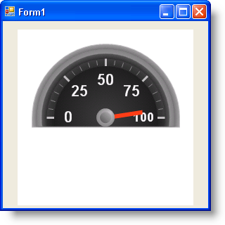

////

|metadata|
{
    "name": "wingauge-creating-a-radial-gauge-using-the-gauge-presets",
    "controlName": ["WinGauge"],
    "tags": ["Charting"],
    "guid": "{A95FE559-1D17-4B0A-8B8B-1AA3C03AFC48}",  
    "buildFlags": [],
    "createdOn": "0001-01-01T00:00:00Z"
}
|metadata|
////

= Creating a Radial Gauge Using the Gauge Presets

== Before You Begin

Creating a Radial gauge using the Gauge Designer allows you to use predefined presets, therefore eliminating a lot of the work required to create Radial gauges.

== What You Will Accomplish

Using the Gauge Designer to create Radial gauges will help you create visually appealing and professional-looking gauges such as speedometers.

== Follow these Steps

[start=1]
. From the toolbox, drag the UltraGauge control to your form. The Gauge Designer opens.

image::images/Gauge_Creating_a_Radial_Gauge_Using_the_Gauge_Designer_01.png[The Wingauge designer that appears when you place ultragauge on a form.]

[start=2]
. On the Toolbar, click Open Presets.
[start=3]
. Click the Radial tab.

image::images/Gauge_Creating_a_Radial_Gauge_Using_the_Gauge_Designer_02.png[WinGauge's presets area for radial gauge.]

[start=4]
. Select a predefined Radial gauge. When you select a gauge it appears in the interactive preview area.

image::images/Gauge_Creating_a_Radial_Gauge_Using_the_Gauge_Designer_03.png[Wingauge with a radial gauge with a preset applied.]

[start=5]
. To create a Radial gauge using the selected preset without closing the Gauge Designer, click Apply. To create a Radial gauge using the selected preset and automatically close the designer, click Apply and Close.
[start=6]
. Run the application. It should look similar to the form below.

