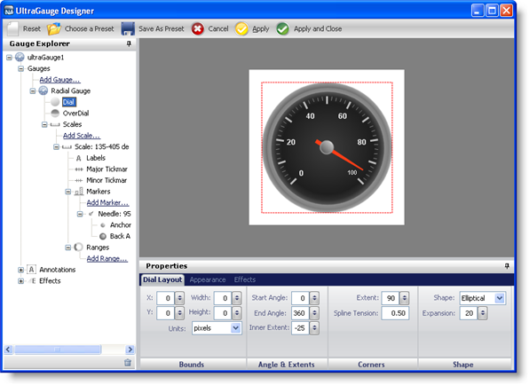
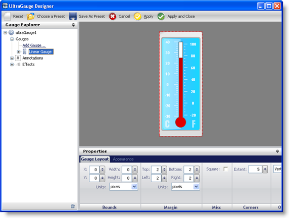
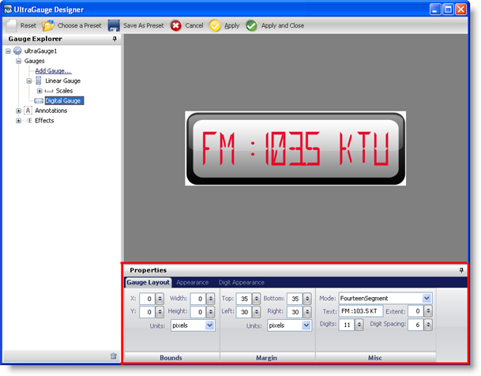
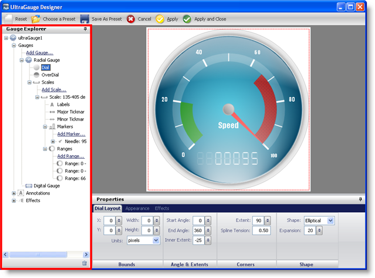

////

|metadata|
{
    "name": "wingauge-designer-added-to-wingauge-whats-new-20072",
    "controlName": [],
    "tags": [],
    "guid": "{FDE5F9A1-50CB-4A86-A385-A8FB0015956C}",  
    "buildFlags": [],
    "createdOn": "0001-01-01T00:00:00Z"
}
|metadata|
////

= Designer Added to WinGauge

Starting in the 2007 Volume 2 release a Designer will be available in WinGauge™.

The designer consists of a gallery of Linear, Digital, and Radial gauges, ranging from basic to complex designs. The designer allows you to choose a predefined gauge and add it to your gauge control. As well, you can easily manipulate your gauge's properties through the designer's user-friendly interface.

== Gauge Presets

The designer helps you to create professional-looking gauges with a minimum amount of work. For example, to create a complex vertically oriented linear gauge, such as a thermometer, you can simply select a preset from the designer, and add it to your Gauge control.

The screen shot below shows an example of a predefined gauge from the designer's gallery.

== Customization

Customization of the designer presets is a very easy process with the designer. In the Properties panel of the designer, all the values of the properties are displayed. When you edit these values in the Properties panel, the changes are instantly reflected in the interactive preview area.

The following screen shot shows an example of the properties of a Digital gauge being displayed in the Properties window.

== Navigation

It is easy to navigate through the properties of the gauge control using the Gauge Explorer of the designer. You can expand the WinGauge control to display the individual gauges within the control. As each gauge is selected, it is highlighted in the interactive preview area. You can also expand each gauge to show the properties and have the properties highlighted in the interactive preview area.

The following screen shot shows the Gauge Explorer of the designer with a Radial gauge selected.

== Related Topic

link:wingauge-designer.html[WinGauge Designer]