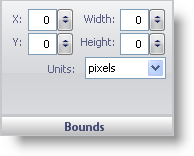

////

|metadata|
{
    "name": "wingauge-dial-bounds-pane",
    "controlName": ["WinGauge"],
    "tags": [],
    "guid": "{52683D7B-756B-4885-AD84-398508054D09}",  
    "buildFlags": [],
    "createdOn": "0001-01-01T00:00:00Z"
}
|metadata|
////

= Bounds Pane

The Bounds pane determines the size and the location of the dial on the WinGauge control.

pick:[win-forms="link:{ApiPlatform}win.ultrawingauge{ApiVersion}~infragistics.ultragauge.resources.dialappearance~bounds.html[X]"]   -- This value determines the distance of the dial from the left of the Gauge control. The x value should not exceed the width of the Gauge control or set to less than 0 as the dial may not appear.

pick:[win-forms="link:{ApiPlatform}win.ultrawingauge{ApiVersion}~infragistics.ultragauge.resources.dialappearance~bounds.html[Y]"]  -- This value determines the distance of the dial from the top of the Gauge control. The y value should not exceed the height of the Gauge control or set to less than 0 as the dial may then not appear.

pick:[win-forms="link:{ApiPlatform}win.ultrawingauge{ApiVersion}~infragistics.ultragauge.resources.dialappearance~bounds.html[Width]"]  -- The width value can be set from 0 to 100. This value determines the width of the dial.

pick:[win-forms="link:{ApiPlatform}win.ultrawingauge{ApiVersion}~infragistics.ultragauge.resources.dialappearance~bounds.html[Height]"]  -- The height value can be set from 0 to 100. This value determines the height of the dial.

pick:[win-forms="link:{ApiPlatform}win.ultrawingauge{ApiVersion}~infragistics.ultragauge.resources.dialappearance~boundsmeasure.html[Units]"]  -- This value specifies the unit of measurement for the dial. The dial can be measured in pixels or as a percentage of the Gauge control.

== Related Topic

link:wingauge-dial-layout-tab.html[Dial Layout Tab]