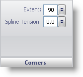

////

|metadata|
{
    "name": "wingauge-dial-corners-pane",
    "controlName": ["WinGauge"],
    "tags": ["Charting"],
    "guid": "{2F4071EC-23E4-4BB6-8AF8-5AB7CD562602}",  
    "buildFlags": [],
    "createdOn": "0001-01-01T00:00:00Z"
}
|metadata|
////

= Corners Pane

The Corners pane determines the size of the corners on the dial on your Radial gauge.

pick:[win-forms="link:{ApiPlatform}win.ultrawingauge{ApiVersion}~infragistics.ultragauge.resources.dialappearance~cornerextent.html[Extent]"]  -- Set this value to an integer from 0 to 999. If you set the start and end angles on the link:wingauge-angle-and-extents-pane.html[Angle and Extents pane] to sweep fewer than 360 degrees or change the shape of the dial to a rectangle on the link:wingauge-shape-pane.html[Shape pane], you can see the effect of the extent value. It determines the roundness of the visible corners.

pick:[win-forms="link:{ApiPlatform}win.ultrawingauge{ApiVersion}~infragistics.ultragauge.resources.dialappearance~cornersplinetension.html[Spline Tension]"]   -- Set this value to a value from 0.0 to 1.0. This value determines the curviness of the corners of the dial.

== Related Topic

link:wingauge-dial-layout-tab.html[Dial Layout Tab]