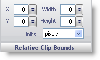

////

|metadata|
{
    "name": "wingauge-digit-appearance-relative-clip-bounds",
    "controlName": ["WinGauge"],
    "tags": ["Charting"],
    "guid": "{2F8B896F-B9E4-46D3-BDC6-3ED0ECA0F537}",  
    "buildFlags": [],
    "createdOn": "2010-06-04T12:05:01Z"
}
|metadata|
////

= Digit Appearance Relative Clip Bounds

The Relative Clip Bounds pane determines the size and the location of a clip region for the digits brush element on your gauge.

X -- This value determines the distance of the clip region of your digits brush element from the left of the Gauge control.

Y -- This value determines the distance of the clip region of your digits brush element from the top of the Gauge control.

Width -- This value determines the width of the clip region.

Height -- This value determines the height of the clip region.

Units -- This value specifies the unit of measurement for your clip region. The clip region can be measured in pixels or as a percentage of the Gauge control.

== Related Topic

link:wingauge-appearance-tab.html[Appearance Tab]

link:wingauge-digit-appearance-tab.html[Digit Appearance Tab]

link:wingauge-labels-appearance-tab.html[Labels Appearance Tab]

link:wingauge-effects-tab.html[Effects Tab]