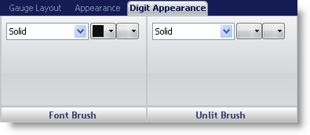
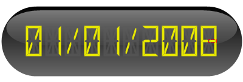

////

|metadata|
{
    "name": "wingauge-digit-appearance-tab",
    "controlName": ["WinGauge"],
    "tags": ["Charting"],
    "guid": "{2E135F4A-0654-47A2-847A-E6AD555D8170}",  
    "buildFlags": [],
    "createdOn": "0001-01-01T00:00:00Z"
}
|metadata|
////

= Digit Appearance Tab

The Digit Appearance tab is used for customizing the data on your Digital gauge. You can access this tab by either clicking the Digital Gauge in the Gauge Explorer or clicking the Digital gauge in the interactive preview area.

The tab is divided into two panes:

* link:wingauge-font-brush-pane.html[Font Brush]
* link:wingauge-unlit-brush-pane.html[Unlit Brush]

The following screen shot shows a Digital gauge that was created according to the digit appearance settings specified in the above screen shot:

