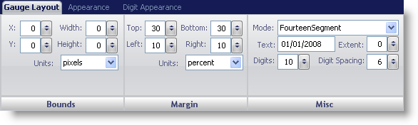
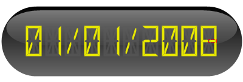

////

|metadata|
{
    "name": "wingauge-digital-gauge",
    "controlName": ["WinGauge"],
    "tags": ["Charting"],
    "guid": "{E3DCBF16-2C08-44FF-9B44-1EC8487439EF}",  
    "buildFlags": [],
    "createdOn": "0001-01-01T00:00:00Z"
}
|metadata|
////

= Digital Gauge

A Digital gauge visually represents data similar to a digital watch or a digital alarm clock. For example, if you wanted to display an odometer, you would create a Digital gauge to display your data.

You can edit the display of your Digital gauge by using the Gauge Layout tab of the Properties panel. You can display this tab by either clicking Digital Gauge in the Gauge Explorer or the clicking the Digital gauge in interactive preview area.

The tab is divided into three panes:

* link:wingauge-bounds-pane.html[Bounds]
* link:wingauge-margin-pane.html[Margin]
* link:wingauge-misc-pane.html[Misc]

The following screen shot shows a Digital gauge that was created according to the layout settings specified in the above screen shot:

