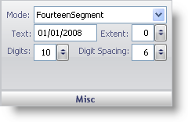

////

|metadata|
{
    "name": "wingauge-digital-misc-pane",
    "controlName": ["WinGauge"],
    "tags": ["Charting"],
    "guid": "{06111C97-CDE0-4A1A-87CD-7528B4F84AFC}",  
    "buildFlags": [],
    "createdOn": "0001-01-01T00:00:00Z"
}
|metadata|
////

= Misc Pane

The Misc pane is used to set miscellaneous properties of your Digital gauge.

pick:[win-forms="link:{ApiPlatform}win.ultrawingauge{ApiVersion}~infragistics.ultragauge.resources.segmenteddigitalgauge~mode.html[Mode]"]  -- The mode value specifies whether your Digital gauge should be represented as a seven- or 14- segment display. For more information on the Mode property, see link:wingauge-working-with-digital-gauges.html[Working with Digital Gauges].

pick:[win-forms="link:{ApiPlatform}win.ultrawingauge{ApiVersion}~infragistics.ultragauge.resources.digitalgauge~text.html[Text]"]  -- The text value represents the data that is displayed on your Digital gauge.

pick:[win-forms="link:{ApiPlatform}win.ultrawingauge{ApiVersion}~infragistics.ultragauge.resources.gauge~cornerextent.html[Extent]"]  -- Set this value to an integer from 0 to 100. This value sets the roundness of the corners of your Digital gauge.

pick:[win-forms="link:{ApiPlatform}win.ultrawingauge{ApiVersion}~infragistics.ultragauge.resources.digitalgauge~digits.html[Digits]"]  -- The digits value determines how many digits your gauge can display.

pick:[win-forms="link:{ApiPlatform}win.ultrawingauge{ApiVersion}~infragistics.ultragauge.resources.digitalgauge~digitspacing.html[Digit Spacing]"]  -- This value sets the distance between each digit displayed on your gauge.

== Related Topic

link:wingauge-digital-gauge.html[Digital Gauge]