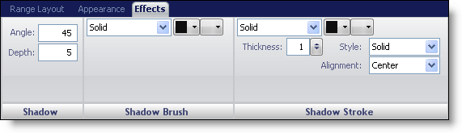
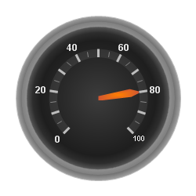

////

|metadata|
{
    "name": "wingauge-effects-tab",
    "controlName": ["WinGauge"],
    "tags": ["Charting"],
    "guid": "{033620B6-5AB2-45C1-B8B9-D00E2E87DE71}",  
    "buildFlags": [],
    "createdOn": "0001-01-01T00:00:00Z"
}
|metadata|
////

= Effects Tab

The Effects tab is associated with all of your gauge properties. This Effects tab allows you to add shadows to any property of your WinGauge control. You can access this tab by either clicking on any item in the Gauge Explorer or clicking on any item on your gauge in the interactive preview area.

This tab is divided into three panes:

* link:wingauge-shadow-pane.html[Shadow]
* link:wingauge-shadow-brush-pane.html[Shadow Brush]
* link:wingauge-shadow-stroke-pane.html[Shadow Stroke]

The following screen shot shows effect applied to the range of a scale according to the settings specified in the above screen shot.

