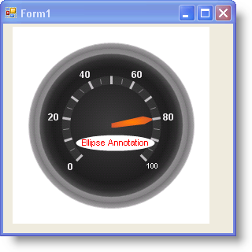

////

|metadata|
{
    "name": "wingauge-ellipse-annotations",
    "controlName": ["WinGauge"],
    "tags": [],
    "guid": "{24FE06C6-2A51-47B7-89E3-01AB81ED6BAF}",  
    "buildFlags": [],
    "createdOn": "0001-01-01T00:00:00Z"
}
|metadata|
////

= Ellipse Annotations

Ellipse annotations are ellipse-shaped objects with text placed inside them. You can use an ellipse annotation to display extra information on your gauge.

For example, if you created a Radial gauge to represent a fuel gauge, you could add annotations with the text set to "Full" and "Empty" at each end of the scale.

The following screen shot shows an example of a Radial gauge with an ellipse annotation.

