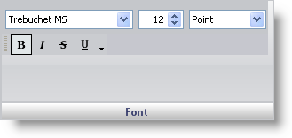

////

|metadata|
{
    "name": "wingauge-font-pane",
    "controlName": ["WinGauge"],
    "tags": ["Charting"],
    "guid": "{697F677F-7B2C-48B3-80D6-95636AB1E82E}",  
    "buildFlags": [],
    "createdOn": "0001-01-01T00:00:00Z"
}
|metadata|
////

= Font Pane

The Font pane is used to edit the font settings of the labels on your gauge.

pick:[win-forms="link:{ApiPlatform}win.ultrawingauge{ApiVersion}~infragistics.ultragauge.resources.labelappearance~font.html[Font]"]  -- This value specifies the font (e.g., Trebuchet MS) of the labels.

Size -- Set this value to an integer from 0 to 100. This value sets the size of the labels' font.

Type --This value specifies the unit of measurement for the font size.

Style -- This value specifies the formatting of the font (e.g., bold and italics).

== Related Topic

link:wingauge-labels-appearance-tab.html[Labels Appearance Tab]