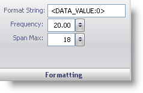

////

|metadata|
{
    "name": "wingauge-formatting-pane",
    "controlName": ["WinGauge"],
    "tags": ["Charting"],
    "guid": "{B799F362-7CF1-4FF6-9456-6C9AFACF331A}",  
    "buildFlags": [],
    "createdOn": "0001-01-01T00:00:00Z"
}
|metadata|
////

= Formatting Pane

The Formatting pane determines the pattern and value of the labels.

pick:[win-forms="link:{ApiPlatform}win.ultrawingauge{ApiVersion}~infragistics.ultragauge.resources.labelappearance~formatstring.html[Format String]"]  -- This value sets the value of the label. If you want the labels to be numeric values, you must set the value to <DATA_VALUE:0>; otherwise, you can enter the text of the label.

pick:[win-forms="link:{ApiPlatform}win.ultrawingauge{ApiVersion}~infragistics.ultragauge.resources.gaugescalelabelsappearance~frequency.html[Frequency]"]  -- Set this value to a value from 1.00 and 100.00. This value determines the intervals at which the labels are displayed.

pick:[win-forms="link:{ApiPlatform}win.ultrawingauge{ApiVersion}~infragistics.ultragauge.resources.radialgaugescalelabelsappearance~spanmaximum.html[Span Max]"]  -- Set this value to an integer from 0 to 100. This value sets the size of the labels on your gauge.

== Related Topic

link:wingauge-labels-layout-tab.html[Labels Layout Tab]