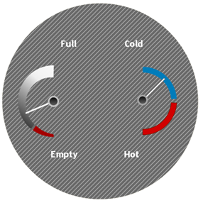

////

|metadata|
{
    "name": "wingauge-hatch-brush-element",
    "controlName": ["WinGauge"],
    "tags": ["Charting"],
    "guid": "{D128923A-55DB-4060-96AA-63EF481B2337}",  
    "buildFlags": [],
    "createdOn": "0001-01-01T00:00:00Z"
}
|metadata|
////

= Hatch Brush Element

Set the brush element to Hatch if you want the background of a property on your gauge to have a grid-like pattern. When you select the Hatch brush element, you can specify the background color, foreground color, and hatch style. You can apply the Hatch brush element to your properties using:

* link:wingauge-apply-the-hatch-brush-element-using-the-gauge-designer.html[the Gauge Designer]
* link:wingauge-apply-the-hatch-brush-element-at-design-time.html[the Gauges collection editor]
* link:wingauge-apply-the-hatch-brush-element-at-run-time.html[code]

The following screen shot shows a Radial gauge with the Dial's BrushElement property set to the following Hatch brush element settings:

* hatch style -- Backward Diagonal
* foreground color -- Silver
* background color -- Dim Gray

