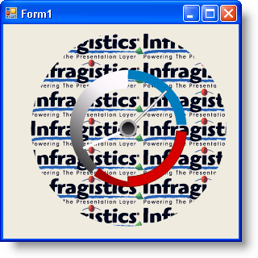

////

|metadata|
{
    "name": "wingauge-image-fill-brush-element",
    "controlName": ["WinGauge"],
    "tags": ["Charting"],
    "guid": "{DEF11911-C10A-4066-8AE7-C42CCE8A4398}",  
    "buildFlags": [],
    "createdOn": "0001-01-01T00:00:00Z"
}
|metadata|
////

= Image Fill Brush Element

Set the brush element to ImageFill if you want the background of a property on your gauge to display as an image. When you select the Image Fill brush element, you can specify an image of your choice. You can apply the Image Fill brush element to your properties using:

* link:wingauge-apply-the-image-brush-element-at-design-time.html[the Gauges collection editor]
* link:wingauge-apply-the-image-fill-brush-element-at-run-time.html[code]

The following screen shot shows a Radial gauge with the Dial's BrushElement property set as an image.

