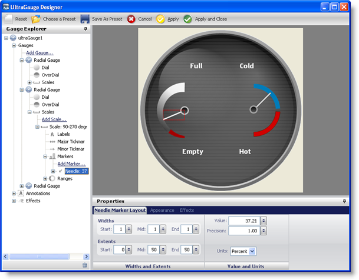

////

|metadata|
{
    "name": "wingauge-interactive-preview-area",
    "controlName": ["WinGauge"],
    "tags": [],
    "guid": "{B30527D6-6287-4787-AA46-CF429AD16D60}",  
    "buildFlags": [],
    "createdOn": "0001-01-01T00:00:00Z"
}
|metadata|
////

= Interactive Preview Area

The interactive preview area displays the object that is currently selected in the Gauge Explorer. The selected object is highlighted in red. If you modify the properties of the selected object through the Properties panel, the changes are instantly reflected in the interactive preview area.

You can also select an object from the preview area, and its properties will be displayed in the Properties panel, and the property will also be highlighted in the Gauge Explorer.

The following screen shot shows a Radial gauge displayed in the interactive preview area with the Marker property outlined by a red box and the settings of the Marker property displayed in the Properties panel.

