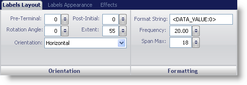
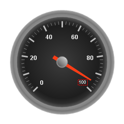

////

|metadata|
{
    "name": "wingauge-labels-layout-tab",
    "controlName": ["WinGauge"],
    "tags": ["Charting"],
    "guid": "{555C5B17-360C-4E9C-9763-3F74E4FD4546}",  
    "buildFlags": [],
    "createdOn": "0001-01-01T00:00:00Z"
}
|metadata|
////

= Labels Layout Tab

The  pick:[win-forms="link:{ApiPlatform}win.ultrawingauge{ApiVersion}~infragistics.ultragauge.resources.radialgaugescale~labels.html[Labels]"]  property of the WinGauge control represents values on the scale. Labels are numeric or text values that are associated with values of the scale.

You can customize the labels on your gauge using the Labels Layout tab of the Properties panel. This access this tab, click Labels in the Gauge Explorer (Gauge > Scale > Labels).

The tab is divided into two panes:

* link:wingauge-orientation-pane.html[Orientation]
* link:wingauge-formatting-pane.html[Formatting]

The following screen shot shows a label that was created according to the layout settings specified in the above screen shot.

