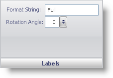

////

|metadata|
{
    "name": "wingauge-labels-pane",
    "controlName": ["WinGauge"],
    "tags": ["Charting"],
    "guid": "{9307496E-D862-48D7-BD3D-E3CFDFA71E70}",  
    "buildFlags": [],
    "createdOn": "0001-01-01T00:00:00Z"
}
|metadata|
////

= Labels Pane

The Labels pane lets you set the text and the rotation angle of the annotation on your gauge.

pick:[win-forms="link:{ApiPlatform}win.ultrawingauge{ApiVersion}~infragistics.ultragauge.resources.labelappearance~formatstring.html[Format String]"]  -- This value specifies the text of your annotation.

pick:[win-forms="link:{ApiPlatform}win.ultrawingauge{ApiVersion}~infragistics.ultragauge.resources.labelappearance~rotationangle.html[Rotation Angle]"]  -- Set this value to an integer from 0 to 100. This value sets the rotation angle of your annotation.

== Related Topic

link:wingauge-annotations-tab.html[Annotations Tab]