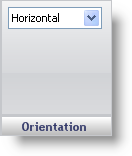

////

|metadata|
{
    "name": "wingauge-linear-orientation-pane",
    "controlName": ["WinGauge"],
    "tags": ["Charting"],
    "guid": "{BE21FBA6-B658-4916-8960-49C23295604C}",  
    "buildFlags": [],
    "createdOn": "0001-01-01T00:00:00Z"
}
|metadata|
////

= Orientation Pane

The Orientation pane is used to set the position of your Linear gauge on the WinGauge control.

Orientation -- This value specifies the position of your gauge. The orientation can be set to Horizontal or Vertical.

== Related Topic

link:wingauge-linear-gauge.html[Linear Gauge]