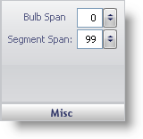
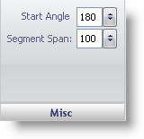

////

|metadata|
{
    "name": "wingauge-misc-pane",
    "controlName": ["WinGauge"],
    "tags": [],
    "guid": "{8E4C0C8F-0A33-44B0-8230-A21BBB1BC54E}",  
    "buildFlags": [],
    "createdOn": "0001-01-01T00:00:00Z"
}
|metadata|
////

= Misc Pane

The Misc pane determines the size of the blub at the start of the bar in a Linear gauge. An example of a blub in a Linear gauge is the blub part of a thermometer. For a Radial gauge, the Misc pane determines the start angle for the bar marker.

pick:[win-forms="link:{ApiPlatform}win.ultrawingauge{ApiVersion}~infragistics.ultragauge.resources.lineargaugebarmarker~bulbspan.html[Bulb Span]"]  -- The value of the blub span can be set from 0 to 100 using the numeric slider. However, you can also enter a value into the text box. This value is the size of the blub

pick:[win-forms="link:{ApiPlatform}win.ultrawingauge{ApiVersion}~infragistics.ultragauge.resources.radialgaugebarmarker~startangle.html[Start Angle]"]  -- Set this value to an integer from 0 to 360. It specifies the start angle for the bar marker on a Radial gauge.

pick:[win-forms="link:{ApiPlatform}win.ultrawingauge{ApiVersion}~infragistics.ultragauge.resources.lineargaugebarmarker~segmentspan.html[Segment Span]"]  -- The value of the segment span can be set from 0 to 100 using the numeric slider. However, you can also enter a value into the text box. This value is the percentage of the entire bar marker that each segment should occupy.

== Related Topic

link:wingauge-bar-marker-layout-tab.html[Bar Marker Layout Tab]