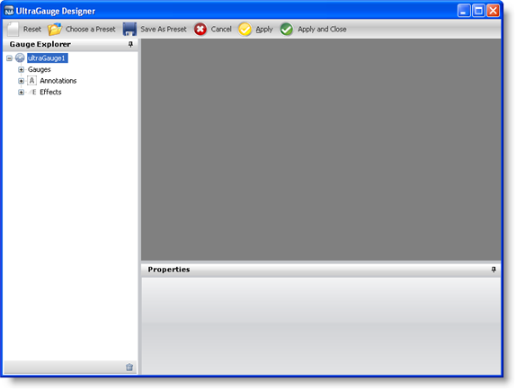

////

|metadata|
{
    "name": "wingauge-modifying-and-saving-a-preset",
    "controlName": ["WinGauge"],
    "tags": [],
    "guid": "{7CFF9E6D-9A39-4322-8BAE-25195C24D928}",  
    "buildFlags": [],
    "createdOn": "0001-01-01T00:00:00Z"
}
|metadata|
////

= Modifying and Saving a Preset

You can modify and save a Gauge preset through the Gauge Designer. This allows you to customize the presets to suit your own needs. For example, you can change the color of a preset to blend in with your own application.

*To modify and save a preset:*

[start=1]
. From the toolbox, drag the UltraGauge control to your form. The Gauge Designer opens.

[start=2]
. On the toolbar, click Choose a Preset. The Gauge Presets dialog box opens with the Radial tab selected by default.

image::images/Gauge_Creating_a_Radial_Gauge_Using_the_Gauge_Designer_02.png[wingauge's designer presets dialog area.]
[start=3]
. Select a predefined Radial gauge. When the Load Preset message appears, click OK. Your gauge appears in the interactive preview area.

image::images/Gauge_Creating_a_Radial_Gauge_Using_the_Gauge_Designer_03.png[wingauge designer with radial gauge with preset applied.]

[start=4]
. In the Gauge Explorer, expand Gauges, then Radial Gauge and select Dial.
[start=5]
. In the Properties panel, click the link:wingauge-appearance-tab.html[Appearance tab].

[start=6]
. In the link:wingauge-brush-pane.html[Brush pane], edit the existing brush elements' colors by selecting the right-hand drop-down lists. For more information about brush elements, see link:wingauge-apply-brush-elements-using-the-gauge-designer.html[Apply Brush Elements Using Gauge Designer].
[start=7]
. Set the color of the first brush element to blend from 240, 240, 240 to 89, 89, 89, with one stop:

** Stop at 0.4 - Color set to 210,210,210\.

[start=8]
. Delete the second brush element by clicking on the cross (x) icon.
[start=9]
. Set the color of the third brush element to blend from transparent to 0, 174, 209, with three stops:

** Stop at 0.0354 - Color set to 180, 180, 180
** Stop at 0.041 - Color set to 240, 240, 240
** Stop at 0.058 - Color set to 0, 79, 118

[start=10]
. In the link:wingauge-stroke-pane.html[Stroke pane], select None from the upper-left drop-down list.

[start=11]
. On the toolbar, click Save As Preset.
[start=12]
. In the Save As Preset dialog box, specify a name and location for your preset, and click Save. Your preset is now saved so that you can use it later to apply to another Gauge control.

== Related Topic

link:wingauge-creating-a-gauge-using-a-preset.html[Create a Gauge Using a Preset]

link:wingauge-applying-a-preset.html[Applying a Preset]