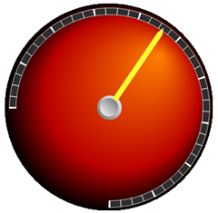

////

|metadata|
{
    "name": "wingauge-multi-stop-radial-gradient-brush-element",
    "controlName": ["WinGauge"],
    "tags": ["Charting"],
    "guid": "{B09003F2-A0B2-4FB4-A7FC-C98C728C42A9}",  
    "buildFlags": [],
    "createdOn": "0001-01-01T00:00:00Z"
}
|metadata|
////

= Multi Stop Radial Gradient Brush Element

If you want more than two colors to blend into each other in a circular fashion on the properties of your gauge, set the brush type to MultiStopRadialGradient. When you select the MultiStopRadialGradient brush element, you can specify more than two colors, the offset for each color, and the center point and focus scales. You can apply the Multi-Stop Radial Gradient brush element to the properties of your gauge using:

* link:wingauge-apply-the-multi-stop-radial-gradient-brush-element-using-the-gauge-designer.html[the Gauge Designer]
* link:wingauge-apply-the-multi-stop-radial-gradient-brush-element-at-design-time.html[the Gauges collection editor]
* link:wingauge-apply-the-multi-stop-radial-gradient-brush-element-at-run-time.html[code]

The following screen shot shows a Radial gauge with the Dial's BrushElement property set to the following MultiStopRadialGradient brush element settings:

* ColorStop 1: Offset = 0, Color = Black
* ColorStop 2: Offset = 0.264, Color = Color.FromArgb(186, 0, 0)
* ColorStop 3: Offset = 1, Color = Color.FromArgb(254, 127, 0)
* Focus scale -- 0, 0
* Center point -- 75, 25
* Center point measure = Percent

