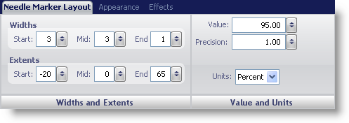
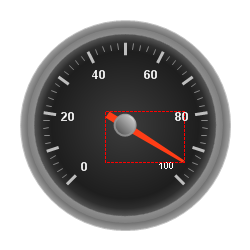

////

|metadata|
{
    "name": "wingauge-needle-marker-layout-tab",
    "controlName": ["WinGauge"],
    "tags": [],
    "guid": "{C1589189-C197-498D-9ED4-91561BCDBA54}",  
    "buildFlags": [],
    "createdOn": "0001-01-01T00:00:00Z"
}
|metadata|
////

= Needle Marker Layout Tab

The  pick:[win-forms="link:{ApiPlatform}win.ultrawingauge{ApiVersion}~infragistics.ultragauge.resources.radialgaugeneedle.html[Needle Marker]"]  property of the WinGauge control is displayed as a pointer that points to a specific value on a scale. For example, if you were creating a Radial gauge to represent a clock, you would use a needle marker to display the hands of the clock.

You can customize the needle marker on your gauge using the Needle Marker Layout tab of the Properties panel. To display this tab, you can either click Needle in the Gauge Explorer (Radial Gauge > Scales > Markers > Needle Marker) or click the needle marker on your Radial gauge in the interactive preview area.

The tab is divided into two panes:

* link:wingauge-widths-and-extents-pane.html[Widths and Extents]
* link:wingauge-value-and-units.html[Value and Units]

The following screen shot shows a needle that was created according to the layout settings specified in the above screen shot.

