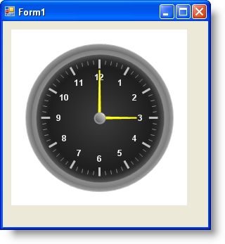

////

|metadata|
{
    "name": "wingauge-needle-marker",
    "controlName": ["WinGauge"],
    "tags": ["Charting"],
    "guid": "{3A179A39-62F1-409B-B625-0D6833282973}",  
    "buildFlags": [],
    "createdOn": "0001-01-01T00:00:00Z"
}
|metadata|
////

= Needle Marker

A needle marker is displayed as a pointer that points to a specific value on a scale.

For example, if you were creating a Radial gauge to represent a clock, you would use a needle marker to display the hands of the clock.

== Related Topic

link:wingauge-add-a-needle-marker-to-a-gauge.html[Add a Needle Marker to a Gauge]