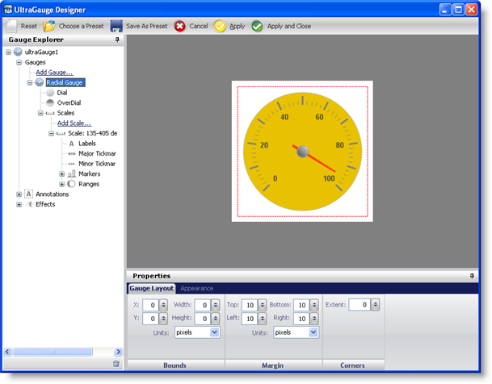

////

|metadata|
{
    "name": "wingauge-opening-a-gauge-preset",
    "controlName": ["WinGauge"],
    "tags": ["Charting"],
    "guid": "{55074132-E621-4A4E-A0EB-FEB16D441530}",  
    "buildFlags": [],
    "createdOn": "0001-01-01T00:00:00Z"
}
|metadata|
////

= Opening a Gauge Preset

There are many predefined Gauge presets available to you through the link:wingauge-designer.html[Gauge Designer]. This topic explains how to open presets using the Gauge Designer so you can use them to create a gauge or modify them to suit your own needs.

*To open a Gauge preset:*

[start=1]
. From the toolbox, drag the UltraGauge control to your form. The Gauge Designer opens.

image::images/Gauge_Creating_a_Radial_Gauge_Using_the_Gauge_Designer_01.png[wingauge's designer that appears when ultragauge is placed on a form.]

[start=2]
. On the toolbar, click Choose a Preset. The Gauge Presets dialog box opens with the Radial tab selected by default.

image::images/Gauge_Creating_a_Radial_Gauge_Using_the_Gauge_Designer_02.png[wingauge's designer presets dialog.]

[start=3]
. Do either of the following:

** Select one of the predefined gauges. When the Load Preset message appears, click OK.
** Click Browse for Preset to browse for your own Gauge preset. In the Open dialog box, navigate to the preset that you want to use, and click Open.

== Related Topics

link:wingauge-modifying-and-saving-a-preset.html[Modifying and Saving a Preset]

link:wingauge-creating-a-gauge-using-a-preset.html[Creating a Gauge Using a Preset]