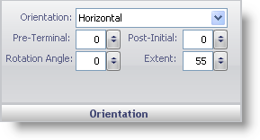

////

|metadata|
{
    "name": "wingauge-orientation-pane",
    "controlName": ["WinGauge"],
    "tags": ["Charting"],
    "guid": "{F5830118-8FAE-404F-9BB9-3C0434C5CE16}",  
    "buildFlags": [],
    "createdOn": "0001-01-01T00:00:00Z"
}
|metadata|
////

= Orientation Pane

The Orientation pane lets you customize the look and feel of the labels on your Radial or Linear gauge.

pick:[win-forms="link:{ApiPlatform}win.ultrawingauge{ApiVersion}~infragistics.ultragauge.resources.radialgaugescalelabelsappearance~orientation.html[Orientation]"]  -- The orientation value determines the positioning of the labels on your Radial gauge. You can set the orientation to the following values:

* Horizontal -- Positions the labels horizontally on your gauge.
* Angular -- Positions the labels in clockwise direction.
* Outward -- Positions the labels facing out from the radius of your gauge.

pick:[win-forms="link:{ApiPlatform}win.ultrawingauge{ApiVersion}~infragistics.ultragauge.resources.gaugescalelabelsappearance~preterminal.html[Pre-Terminal]"]  -- Set this value to an integer from 0 to 100. This value is used to set the end value of the label, rotating in a counter-clockwise direction, decreasing in intervals specified by Frequency value in the Formatting Pane.

pick:[win-forms="link:{ApiPlatform}win.ultrawingauge{ApiVersion}~infragistics.ultragauge.resources.labelappearance~rotationangle.html[Rotation Angle]"]  -- Set this value to an integer from 0 to 100. This value rotates the labels in a clockwise direction.

pick:[win-forms="link:{ApiPlatform}win.ultrawingauge{ApiVersion}~infragistics.ultragauge.resources.gaugescalelabelsappearance~postinitial.html[Post-Initial]"]  -- Set this value to an integer from 0 to 100. This value determines the starting value for the label, rotating in a clockwise direction, increasing in intervals specified by the Frequency value in the link:wingauge-formatting-pane.html[Formatting Pane].

pick:[win-forms="link:{ApiPlatform}win.ultrawingauge{ApiVersion}~infragistics.ultragauge.resources.gaugescalelabelsappearance~extent.html[Extent]"]  -- Set this value to an integer from 0 to 100. With a Radial gauge, this value specifies the distance of the label from the center. With a Linear gauge, this value specifies the distance of the left side of your Linear gauge. If you set the value greater than 100 or less than 0, the labels will not be displayed on your gauge.

== Related Topic

link:wingauge-labels-layout-tab.html[Labels Layout Tab]